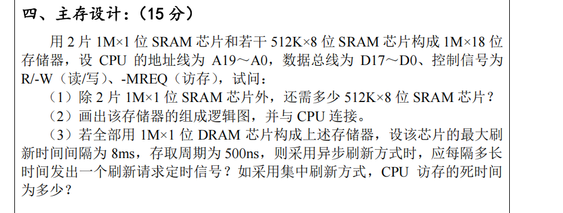
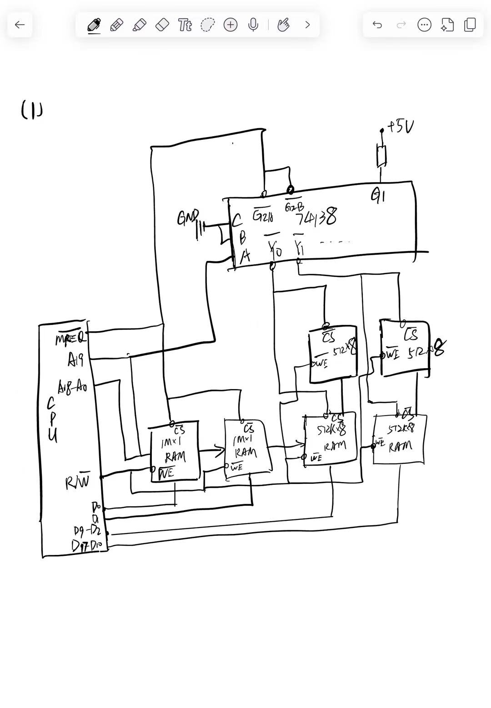
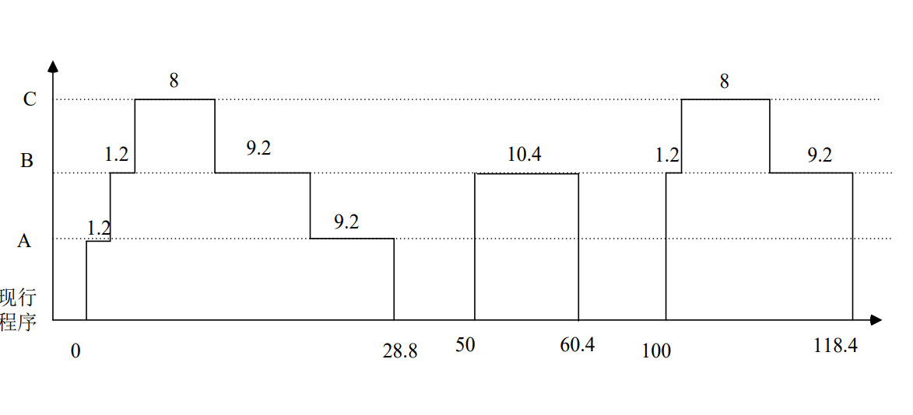

## 课程考试提纲


## 概论
### 计算机系统的组成


----
### 计算机硬件
#### 冯·诺伊曼计算机架构
##### 组成与特点

##### 图示

##### 缺点
每次I/O都需要运算器参与，浪费很多可以用于运算的时间。
##### 例题

>操作数，Operand，就是指令要处理的对象/数据。


#### 现代计算机的结构
##### 图示

##### 运算器与控制器

##### 特点
**以存储器为中心**。
##### 集成

>数据线和反馈线就属于总线的范畴。
##### 例题

>还有逻辑运算。

----
### 计算机软件
#### 分类

#### 发展


#### 例：C语言的编译过程


---
### 计算机系统层次结构
#### 计算机系统层次结构


#### 软件和硬件的逻辑功能等价性

##### 软硬件实现途径的对比

#### 例题


----
### 计算机的基本工作原理
#### 运算器

- `ACC`：累加器；
- `ALU`：算术逻辑单元；
- `MQ`：乘商寄存器
- `X`：操作数寄存器
##### 加/减法
```
(M) -> X
(ACC) +/- (X) -> ACC
```
##### 乘法
```
# 假设ACC中已经存有上一时刻的运算结果，作为下述运算的一个操作数
(M) -> MQ
(ACC) -> X
(X) x (MQ) -> ACC // MQ # 高位存储在ACC，低位保留在MQ中
```
##### 除法
```
(M) -> X
(ACC) / (X) -> MQ
```
#### 主存储器
##### 组成
- 存储体
- MAR
- MDR
##### 存储体

>注意**存取操作需要在CPU的控制器的控制下进行**！
#### 控制器

##### 控制器工作三阶段
- 取指：控制从主存中读一条指令
	- `(PC)->MAR`，`MAR`寻址；
	- 存储单元中的内容送进`MDR`
	- `(MDR)->IR`
- 分析：对指令分析（得操作码），寻址（得操作数）；
	- `OP(IR)->CU`
- 执行：根据操作码和操作数完成指令。
	- `Ad(IR)->MAR`
	- 对操作数寻址找到的存储单元内容送入`MDR`
	- `(MDR)->运算器`（举例子）

##### 程序计数器（PC）
存放当前将执行指令的地址。
- PC和MAR之间有直接通路；
- PC有“自动加1”功能（自动形成下一条指令的地址）
##### 指令寄存器（IR）
- 内容来自MDR
- IR中操作码会送至CU，用来分析指令（`OP(IR) -> CU`）
- IR之中地址码作为操作数地址送到MAR，用来从内存中取操作数。（`Ad(IR)->MAR`）

#### 例题


----
### 性能指标

#### 基本指标
##### 机器字长
- 机器字长和CPU内部**ALU的位数**以及**通用寄存器**的宽度相等
##### 主存容量

###### 主存储器（内存）组成
- 存储体：内有存储单元，存储单元有存储字长；
- MDR：存储器数据寄存器（Memory Data Register）；
- MAR：存储器地址寄存器，$存储单元数=2^{len(MAR)}$。

##### 吞吐量
计算机系统**在单位时间内能够处理的信息量**。
###### 影响因素

##### 响应时间

- 起点：向系统提交作业；
- 终点：完成作业为止。
##### 例题

>指令有单独的**指令字长**。
#### 运算速度指标
##### CPU时钟频率（主频）/时钟周期

###### 单位

##### CPI
执行一条指令需要的时钟周期数量（Cycles per Instruction）。
###### 例题

>答案：2.24


>答案：D
##### CPU 执行时间

###### 例题

>答案：$\dfrac{4}{3}$


>答案：$\dfrac{10}{9}$
##### IPC
Instructions Per Cycle：每个时钟周期能够执行的指令数量，是CPI的倒数。

##### MIPS
每秒执行几百万条指令。

###### 例题

>答案：$\dfrac{1250}{7}$


>答案：C。牢记公式：$MIPS=(\dfrac{f}{CPI})\div 10^6$
##### MFLOPS
每秒执行多少百万次浮点运算。
###### 其他衡量浮点运算速度的单位

###### 例题

#### 基准程序

###### 例题

>答案：D。注意原文“**提高50%**”。

----
## 数据表示
### 定点数
#### 定义
小数点位置**固定不变**的数。分为定点整数、定点小数或者整数+小数。
#### 原码/反码/补码
##### 定点整数

##### 定点小数

##### 运算
- 原码运算，不能按照数值表示直接计算（符号位不能直接参与运算）；
- 反码运算可以带入符号位运算，但是符号位产生的进位需要循环相加到数值位最低位；
- 补码运算可以直接运算（减法可以转换成加法运算，符号位进位作为模被舍弃）。
##### 在计算机中的应用

#### 移码
##### 定义
$$[x]_移=x+2^n$$
##### 应用范围
仅仅用于**定点整数**的表示。
##### 例子


>实际上同一真值对应的。所以在移码中**0也只有一种表示**。

##### 优点
**保持了真值原有的大小顺序**，可以直接比较大小。
#### 对比总结
##### 转换关系

>关键：**补码的补码是原码！**
##### 0的表示
- **移码**和**补码**对于0只有一种表示，而其他都是有两种。
- 对于补码来说，`10000000`表示`-128`，这个不能用“取反+1”法来理解，而可以用“位权法”，也就是最高位的权值是负的，第7位（从0开始）的权值是$-2^7$。
>习题：8位原码能表示的不同数据的数量是多少？
>**答案：255**
><font color="purple">解答：可以利用表示0的性质来快速解决这一问题。8位原码包含1位符号位和7位数值位，总共有256种不同的二进制码组合，其中10000000和00000000都表示0,其余表示的数字都不会重复，所以是256-1=255种。</font>
##### 便捷的转码计算方法
###### 扫描法
用于补码和原码之间。扫描当前数码，保持**右起第一个1和它右边所有的0不变**，剩下的数值位全都取反，就能得到原码。这个方法是双向可用的，也适合$原码\rightarrow补码$。

###### 反码法
也是用于补码和原码之间的转换，同样是双向适用。因为**补码的补码是原码**，所以对补码求补码就是原码。


----
### 浮点数
>定点小数主要用于表示浮点数的尾数，实际上并没有高级语言数据类型与之对应！常用表示小数的方法是浮点表示。
#### 定义

>- 基数隐含约定，由机器决定，运算时不发生变化，所以不需要显式规定；
>- **移码**不用于表示尾数。
#### 表示范围（以阶码和尾数均原码表示为例）
1. 正最大值：阶码取最大正，尾数取最大正；
$$2^{(2^k - 1)}\times (1-2^{-n})$$
2. 正最小值：阶码取最小负（就是阶符取负，数值位取最大），尾数取最小正；
$$2^{-(2^k - 1)}\times (2^{-n})$$
3. 负最小值：阶码取最大正，尾数取最小负；
$$2^{(2^k - 1)}\times (-(1-2^{-n}))$$
4. 负最大值：阶码取最小负，尾数取最大负。
$$2^{-(2^k - 1)}\times (-2^{-n})$$


>例题：
>
#### 溢出
- 上溢：浮点数阶码大于最大阶码，此时机器停止运算，运算器件显示溢出；（**超范围**）
- 下溢：浮点数阶码小于最小阶码，此时尾数强制置0,按照机器0计算，也就是损失精度；（**超精度**）

#### 浮点数规格化
##### 定义
在表示时，浮点数尾数的 <u>原码</u> 最高数值位必须是有效值（也就是`1`）。
对于非规格化尾数，需要对它进行规格化操作。将尾数的数值位进行左移/右移，并相应调整阶码值，分别称为左规/右规。

##### 规格化后浮点数的表示范围

##### 优点
- 使浮点数表示形式唯一；
- 使得浮点数表示的**精度最高**
##### 例题


>这一题要注意，一定是看**尾数的原码**的最高位是否是有效位。

#### IEEE 754 浮点数表示约定
用*S*表示符号位，用*E*表示阶码，*M*表示尾数。


>*阶移尾原*，但是此处的移码的定义与标准移码还有不同。详见下。
##### 阶码 

>上面一行移码是规定中的方法，而下面一行移码是此前讲述的标准移码。

所以，相当于“取反不加1”，也可以看成标准移码的对应关系右移一下。这里的$2^7-1$被称为**偏置常数**。
为什么？**为了不发生上溢。**

这里把全1和全0两个阶码保留，用于特殊用途，所以最小的阶码是`-126`，规格化数取倒数后，阶码正好是`126`，并不发生上溢，这就是移码采用`+2^7-1`的原因。
##### 尾码
>以32位单精度浮点数为例
- 后面的符号位前移动到整个浮点数最左侧（就是那个最左边的符号位）；
- 尾数不包含符号位；因为默认是规格化小数，所以最高位一定是`1`，因为隐藏不表，分配的`23`位用来表示最高位之后的尾码。所以实际上尾码是有24位的。这样可以提高尾数的精度。

>这里一定注意，完整的尾数形式是`1.M`，也就是小数点的默认位置在被省略的最高位`1`的后面！
##### 表示标准总结

以下是`float`和`double`两种精度浮点数的标准总结。

##### 浮点数表示范围推导
###### 规格化数

###### 非规格化数


##### 例题


----
### C语言中的数据类型/转换
#### 数据类型
- 数据以二进制的形式存储在寄存器/存储器中；
- 汇编语言中的数据类型取决于**指令操作码**；
- 变量类型

- 取值范围

>应用的时候要谨慎，因为C语言本身不对溢出作检查。

#### 数据转换
目的就是**尽量保持真值不变**。
##### 整型数据之间
有三种问题类型：
1. 相同字长之间的转换；
2. 小字长转大字长
3. 大字长转小字长
###### 相同字长

就是按照机器码直接转换，所以以上图为例，只有取值范围重合的区域才会数值相同，因为都是正数，其他两个区域都会造成实际表示的值变化。

###### 小字长转大字长

总之就是无符号用0，而有符号就按照符号拓展。
###### 大字长转小字长

就是截断，可能导致数值不同。
###### 总结

>只有同字长交集部分/小转大原为无符号数时不会出错。
##### 整型和浮点型之间的转换
###### float->double
因为`double`精度高，所以转换无错。
###### double->float
- 大数转换，可能发生溢出
- 高精度数转换，发生舍入
###### float/double->int
- 小数部分直接截断舍弃；
- 整数部分可能发生溢出
###### int->float
当`int`的高8位数据非0的时候，就会发生**精度丢失**，因为`float`无法表示比24位精度更高的数字，所以会有偏差；但是不会发生数值范围的溢出。
###### int->double
可以精确表示。
###### 例题


----
## 运算方法
### 移位运算
#### 逻辑移位
- 逻辑移位的对象：无符号数
- 规则：一律补0
#### 算术移位
- 正数的原/反/补一样，所以无所谓，补0就可以；
	- 如果左移时最高位丢1，则发生溢出，结果出错；
	- 如果右移时最低位丢1，则精度缺失。
- ==**负数的移位需要注意**==

>因为负数的反码的`1`相当于原来的`0`，所以移位的时候要填`1`；
>而补码这里由于“取反+1”的原因，所以左移的时候填`0`正好正确；而右移空位则是和反码一样填`1`。
#### 循环移位
分为以下四种：
- 带CF的循环右移/左移；
- 不带CF的循环右移/左移。


>总之就是如果带标志位，就在循环的时候带上标志位一起循环；不带就是只有原来的数位参与循环，CF储存中间结果。
##### 应用
- 加密算法：实现数据的混淆和置换；
- 哈希函数：改变输入数据的排列顺序，产生不同哈希值，增强哈希函数的混淆性和扩散性；
- 优化算法：用于优化性能和节省资源。
----
### 定点数加减法的硬件逻辑实现
#### 运算公式

符号位的进位值作为模数应该抹去。
#### 溢出检测
>溢出（overflow）：运算结果超过所能表示数据范围。溢出会导致错误的运算结果。
##### 方法1：操作数和结果符号位是否一致
本方法基于这样一个前提（易证）：**只有相同符号位的两个操作数相加才有可能发生溢出。**

判断方法：异号则溢出

>这个方法可以推广到补码减法，因为补码减法最终一定会被转化成加法。
###### 逻辑表达

##### 方法2：最高数值位进位和符号位进位是否一致

###### 逻辑表达

##### 方法3：使用变形补码
>变形补码：拥有两位符号位的补码。


###### 逻辑表达

##### 例题


----
#### 逻辑代数与逻辑门

>指这一与门器件的工作电压为`6V`, 负载电容为`50pF`，最大门级延迟是`15ns`。


>异或和同或的符号需要记忆。
#### 一位全加器的硬件实现


进一步化简得到


#### 串行进位加法器硬件实现
##### 结构与溢出检测
又称为**行波进位加法器**。

>溢出检测采用方法2。用一个异或门连接$C_{n}$和$C_{n-1}$，就可看出结果。
##### 兼容补码减法

>如果`sub`为0，表示`X+Y`，如果`sub`为1，表示`X-Y`。
##### 性能分析

##### 例题

#### 先行进位加法器的硬件实现
##### 逻辑构建


##### 电路构建

##### 4位先行进位电路

###### 组内并行、组间串行的16位加法器

>当使用4位快速加法器构建更大位宽的加法器时，性能差距就明显了。
###### 组内组间并行进位的16位加法器

**组进位生成函数**

**组进位传递函数**

**电路结构**

###### 性能分析


----
### 无符号数乘法运算的硬件逻辑实现
#### 二进制乘法的笔算方法

#### 机器实现

#### ALU结构

#### 运算实现过程

分步骤写法：
1. `(X)+(ACC)->ACC`（加）
2. `(C_out),(ACC),(MQ)>>1`（移）
### 定点数原码乘法运算的硬件逻辑实现

>**“一位乘法”** 的意思是，运算的时候每次根据乘数中的一位来计算位积。

以定点小数的乘法运算为例：

#### 总结
##### 定点数原码乘法的运算的基本实现流程


### 定点数补码乘法运算的硬件逻辑实现
#### Booth算法
##### 算法原理
Booth算法直接对**补码**进行运算，符号位参与运算，无需单独处理。

##### 核心思想
利用乘数相邻两位的差值来决定操作：
- 设乘数为 $Y = y_0.y_1y_2...y_n$（$y_0$ 为符号位）
- 引入辅助位 $y_{n+1} = 0$
- 根据 $y_i y_{i+1}$ 的组合决定操作
##### 操作规则
| $y_i$ | $y_{i+1}$ | $y_{i+1} - y_i$ | 操作                        |
| ----- | --------- | --------------- | ------------------------- |
| 0     | 0         | 0               | 部分积右移一位                   |
| 0     | 1         | +1              | 部分积 **加** $[X]_补$，然后右移一位  |
| 1     | 0         | -1              | 部分积 **加** $[-X]_补$，然后右移一位 |
| 1     | 1         | 0               | 部分积右移一位                   |


##### 运算流程
1. **初始化**：
   - 部分积 P = 0
   - 被乘数 X 存入 X 寄存器
   - 乘数 Y 存入 MQ 寄存器，末尾添加辅助位 $y_{n+1} = 0$
   
2. **迭代 n+1 次**（n 为数值位数）：
   - 检查 MQ 最低两位 $y_i y_{i+1}$
   - 根据操作规则执行加法或减法
   - **算术右移**一位（符号位保持不变），部分积的最低位移入MQ高位。移入MQ的位不再参与加减运算，但它们构成最终乘积的低位部分；同时MQ的右移会更新辅助位，用于下一轮操作判断。
   
3. **最后一步不移位**，直接得到结果
   - 最终乘积 = `[ACC, MQ]` 拼接，ACC存放高位，MQ存放低位

##### 计算示例
设 $X = -0.1101$，$Y = +0.1011$，求 $X \times Y$

**准备工作**：
- $[X]_补 = 1.0011$
- $[-X]_补 = 0.1101$
- $[Y]_补 = 0.1011$

**运算过程**（采用双符号位）：

| 步骤      | 部分积P       | 乘数MQ（去掉后一位辅助位） | 辅助位 | 操作说明                          |
| ------- | ---------- | -------------- | --- | ----------------------------- |
| 初始      | 00.0000    | 0.1011         | 0   | $y_4y_5 = 10$，加 $[-X]_补$      |
| 第1次加法结果 | 00.1101    | 0.1011         | 0   | 加 $[-X]_补$ 后右移                |
|         | 00.0110    | 1.0101         | 1   | 右移结果，$y_3y_4 = 11$            |
| 第2次加法结果 | 00.0110    | 1.0101         | 1   | 仅右移                           |
|         | 00.0011    | 0.1010         | 1   | 右移结果，$y_2y_3 = 01$            |
|         | 00.0011    | 0.1010         | 1   | 加 $[X]_补$                     |
| 第3步加法结果 | 11.0110    | 0.1010         | 1   | 加后结果                          |
|         | 11.1011    | 0.0101         | 0   | 右移结果，$y_1y_2 = 10$，加 $[-X]_补$ |
| 第4步加法结果 | (1)00.1000 | 0.0101         | 0   | 高位产生进位，直接舍弃                   |
|         | 00.0100    | 0.0010         | 1   | 右移结果，$y_0y_1 = 01$            |
|         | 00.0100    | 0.0010         | 1   | 加 $[X]_补$，**不移位**             |
| 第5步加法结果 | 11.0111    | 0.0010         | 1   | 最终结果                          |

**结果**：$[X \times Y]_补 = 1.01110001$，真值为 $-0.10001111$
##### 硬件框图


##### 算法特点
1. **符号位参与运算**：无需单独处理符号
2. **采用算术右移**：保持符号位不变
3. **迭代次数**：n+1 次（比原码乘法多一次）
4. **最后一步不移位**
5. **适用于定点整数和定点小数**
##### 与原码乘法对比
| 特性 | 原码一位乘法 | Booth算法 |
|------|-------------|-----------|
| 符号处理 | 单独异或 | 参与运算 |
| 操作数形式 | 原码 | 补码 |
| 迭代次数 | n 次 | n+1 次 |
| 移位方式 | 逻辑右移 | 算术右移 |
| 最后一步 | 移位 | 不移位 |

----
### 定点数除法运算

#### 二进制除法的笔算方法
与十进制除法类似，二进制除法也是通过"试商-相减-移位"的方式完成。

设被除数 $X = 0.1011$，除数 $Y = 0.1101$，求 $X \div Y$：
```
        0.1101  (商)
      ________
0.1101 | 0.10110000
         0.1101
         ------
         0.01000    (余数左移继续除)
           0.1101
           ------
           0.0011   (不够减，商0)
             ...
```

#### 原码除法

##### 基本概念
- **被除数**存放在**ACC（高位）和MQ（低位）** 组成的联合寄存器中
- **除数**存放在**X寄存器**中
- **商**逐位产生，存入**MQ**
- **余数**最终留在**ACC**中

##### 恢复余数法
###### 算法思想
每次用余数**减去除数**（实际是加上$[-Y]_补$）：
- 若余数**≥0**（符号位为0）：商上**1**
- 若余数**<0**（符号位为1）：商上**0**，并**恢复余数**（加回除数）

然后将余数和商一起**左移一位**，继续下一轮运算。

###### 运算规则
1. **符号单独处理**：商的符号 = 被除数符号 ⊕ 除数符号
2. 数值部分用原码绝对值进行运算
3. 初始时，被除数放在 ACC 中，MQ 清零
4. 迭代 n 次（n 为尾数位数）

###### 运算流程
```
初始化：
  ACC ← |X|（被除数绝对值）
  MQ ← 0（用于存放商）
  X寄存器 ← |Y|（除数绝对值）

循环 n 次：
  Step 1: ACC ← ACC - X（减除数）
  Step 2: 判断 ACC 符号位
          若 ACC ≥ 0：MQ末位置1
          若 ACC < 0：MQ末位置0，ACC ← ACC + X（恢复）
  Step 3: (ACC, MQ) 联合左移一位

最终：
  商的符号 = 被除数符号 ⊕ 除数符号
  商的数值 = MQ 内容
  余数 = ACC 内容（需要根据左移次数调整）
```

###### 计算示例
设 $X = 0.1011$，$Y = 0.1101$，求 $X \div Y$

**准备工作**：
- $|X| = 0.1011$，$|Y| = 0.1101$
- $[-Y]_补 = 1.0011$
- 符号位：$0 \oplus 0 = 0$（结果为正）

**运算过程**（采用双符号位，4位尾数，迭代4次）：

| 步骤 | ACC（余数） | MQ（商） | 操作说明 |
|------|-------------|----------|----------|
| 初始 | 00.1011 | 0000 | 减除数（+$[-Y]_补$） |
| | 11.1110 | 0000 | 结果<0，商0，恢复余数 |
| | 00.1011 | 0000 | 恢复后，左移 |
| 左移1 | 01.0110 | 0000 | 减除数 |
| | 11.1001 | 0000 | 结果<0，商0，恢复 |
| | 01.0110 | 0000 | 恢复后，左移 |
| 左移2 | 10.1100 | 0000 | 减除数 |
| | 01.1111 | 0001 | 结果≥0，商1，左移 |
| 左移3 | 11.1110 | 0010 | 减除数 |
| | 01.0001 | 0011 | 结果≥0，商1，左移 |
| 左移4 | 10.0010 | 0110 | 减除数 |
| | 00.0101 | 0111 | 结果≥0，商1 |

**结果**：
- 商 $Q = 0.0111$（前面符号位为正，即+0.0111）
- 余数需要乘以 $2^{-4}$（因为左移了4次）

###### 特点
- **优点**：算法直观，容易理解
- **缺点**：恢复余数需要额外的加法操作，运算次数不固定

##### 加减交替法（不恢复余数法）
###### 算法思想
**核心改进**：当余数为负时，不再恢复余数，而是将余数左移后**加上除数**。

这是因为：恢复余数再左移，相当于 $(R + Y) \times 2 = 2R + 2Y$；而不恢复直接左移再加，相当于 $2R + Y$。二者差一个 $Y$，正好在下一步的加/减操作中体现。

###### 运算规则
| 当前余数符号 | 操作 | 商 |
|-------------|------|-----|
| **正**（≥0） | 左移，**减**除数 | 上**1** |
| **负**（<0） | 左移，**加**除数 | 上**0** |

最后一步若余数为负，需要**恢复余数**（加回除数），保证余数为正。

###### 运算流程
```
初始化：
  ACC ← |X|（被除数绝对值）
  MQ ← 0
  X寄存器 ← |Y|

第一步：ACC ← ACC - X（先做一次减法）

循环 n 次：
  若 ACC ≥ 0：MQ末位置1，(ACC,MQ)左移，ACC ← ACC - X
  若 ACC < 0：MQ末位置0，(ACC,MQ)左移，ACC ← ACC + X

最后一步：
  若 ACC ≥ 0：MQ末位置1
  若 ACC < 0：MQ末位置0，ACC ← ACC + X（恢复余数）
```

###### 计算示例
设 $X = 0.1000$，$Y = 0.1011$，求 $X \div Y$（原码加减交替法）

**准备工作**：
- $|X| = 0.1000$，$|Y| = 0.1011$
- $[Y]_补 = 0.1011$，$[-Y]_补 = 1.0101$

**运算过程**（双符号位，4位尾数）：

| 步骤 | ACC（余数） | MQ（商） | 操作说明 |
|------|-------------|----------|----------|
| 初始 | 00.1000 | 0000 | 初始减除数（+$[-Y]_补$） |
| | 11.1101 | 0000 | 结果<0，商0 |
| 左移+加 | 11.1010 | 0000 | 左移后加除数 |
| | 00.0101 | 0001 | 结果≥0，商1 |
| 左移+减 | 00.1010 | 0010 | 左移后减除数 |
| | 11.1111 | 0010 | 结果<0，商0 |
| 左移+加 | 11.1110 | 0100 | 左移后加除数 |
| | 00.1001 | 0101 | 结果≥0，商1 |
| 左移+减 | 01.0010 | 1010 | 左移后减除数 |
| | 00.0111 | 1011 | 结果≥0，商1 |

**结果**：商 $Q = 0.1011$，余数 $R = 0.0111 \times 2^{-4}$

###### 硬件结构

>原码加减交替法的硬件结构与乘法类似，都需要ACC、MQ、X寄存器和ALU。

###### 与恢复余数法对比

| 特性 | 恢复余数法 | 加减交替法 |
|------|-----------|-----------|
| 余数为负时 | 恢复（+Y），再左移减Y | 直接左移加Y |
| 操作次数 | 不固定（最多2n次加减） | 固定（n+1次加减） |
| 运算速度 | 较慢 | 较快 |
| 最后一步 | 无特殊处理 | 若余数<0需恢复 |
| 实际应用 | 较少使用 | **常用** |

##### 例题
**例1**：用原码加减交替法计算 $X \div Y$，其中 $X = -0.10101$，$Y = 0.11001$

**解**：
1. 符号单独处理：商的符号 = $1 \oplus 0 = 1$（负）
2. 取绝对值：$|X| = 0.10101$，$|Y| = 0.11001$
3. 按加减交替法计算数值部分
4. 最终商为负数

---

#### 补码除法（加减交替法）

##### 与原码除法的区别
补码除法直接对**补码**进行运算，**符号位参与运算**，无需单独处理。

##### 运算规则
根据**被除数（余数）与除数的符号关系**决定操作：

| 余数与除数符号 | 操作 | 商 |
|---------------|------|-----|
| **同号** | 左移，余数**减**除数 | 上**1** |
| **异号** | 左移，余数**加**除数 | 上**0** |

##### 商的校正
- 若被除数与除数**同号**，商为**正**，末位恒置**1**（商+$2^{-n}$校正）
- 若被除数与除数**异号**，商为**负**，末位恒置**1**后再**加1**

##### 运算流程
```
初始化：
  ACC ← [X]_补（被除数补码）
  MQ ← 0
  X寄存器 ← [Y]_补

第一步：判断 X 和 Y 符号
  若同号：ACC ← ACC - Y（减除数）
  若异号：ACC ← ACC + Y（加除数）

循环 n 次：
  判断当前余数与除数符号：
  若同号：MQ末位置1，(ACC,MQ)左移，ACC ← ACC - Y
  若异号：MQ末位置0，(ACC,MQ)左移，ACC ← ACC + Y

最后：商的末位置1（校正）
```

##### 计算示例
设 $X = 0.1000$，$Y = -0.1011$，求 $[X \div Y]_补$

**准备工作**：
- $[X]_补 = 0.1000$
- $[Y]_补 = 1.0101$，$[-Y]_补 = 0.1011$
- 被除数为正，除数为负，**异号**

**运算过程**（双符号位）：

| 步骤 | ACC（余数） | MQ（商） | 余数与Y符号 | 操作说明 |
|------|-------------|----------|------------|----------|
| 初始 | 00.1000 | 0000 | 异号 | 加除数 |
| | 11.1101 | 0000 | 同号 | 商0，左移，减除数 |
| 左移1 | 11.1010 | 0000 | - | 减除数 |
| | 00.0101 | 0001 | 异号 | 商1，左移，加除数 |
| 左移2 | 00.1010 | 0010 | - | 加除数 |
| | 11.1111 | 0010 | 同号 | 商0，左移，减除数 |
| 左移3 | 11.1110 | 0100 | - | 减除数 |
| | 00.1001 | 0101 | 异号 | 商1，左移，加除数 |
| 左移4 | 01.0010 | 1010 | - | 加除数 |
| | 11.0111 | 1010 | 同号 | 商0 |
| 校正 | - | 1011 | - | 末位置1（实为+1） |

**结果**：$[X \div Y]_补 = 1.0101$

##### 与原码除法对比

| 特性 | 原码加减交替法 | 补码加减交替法 |
|------|---------------|---------------|
| 符号处理 | 单独异或 | 参与运算 |
| 操作数形式 | 原码绝对值 | 补码 |
| 判断依据 | 余数符号 | 余数与除数符号关系 |
| 同号操作 | - | 减除数，商1 |
| 异号操作 | - | 加除数，商0 |
| 商的校正 | 无 | 末位置1（或+1） |

##### 例题
**例2**：用补码加减交替法计算 $[-0.10110] \div [0.11011]$

**解**：
1. $[X]_补 = 1.01010$，$[Y]_补 = 0.11011$，$[-Y]_补 = 1.00101$
2. 被除数为负，除数为正，异号，第一步加除数
3. 迭代5次后进行商的校正
4. 结果为负数的补码形式

---

#### 除法运算总结

| 算法 | 符号处理 | 核心规则 | 迭代次数 | 特点 |
|------|---------|---------|---------|------|
| 恢复余数法 | 单独处理 | 余数<0时恢复 | ≤2n | 操作次数不固定 |
| 原码加减交替 | 单独处理 | 余数<0则左移加Y | n+1 | 固定次数，效率高 |
| 补码加减交替 | 参与运算 | 同号减Y，异号加Y | n+1 | 直接处理补码 |

----
### 浮点数运算

#### 浮点数加减法

##### 运算步骤概述
浮点数加减法分为以下五个步骤：
1. **对阶**：使两个操作数的阶码相同
2. **尾数加减**：对对阶后的尾数进行加/减运算
3. **规格化**：将结果规格化
4. **舍入处理**：处理精度损失
5. **溢出判断**：检查是否发生上溢或下溢

##### 1. 对阶
###### 原则
**小阶向大阶看齐**（即小阶码增大，尾数右移）

###### 原因
- 如果大阶向小阶对齐，则大阶的尾数需要**左移**，可能导致**高位有效数字丢失**，造成较大误差
- 小阶向大阶对齐，尾数**右移**，丢失的是**低位**，误差较小

###### 具体操作
设两个浮点数 $X = M_X \times 2^{E_X}$，$Y = M_Y \times 2^{E_Y}$
1. 求阶差：$\Delta E = E_X - E_Y$
2. 若 $\Delta E > 0$：$E_Y \leftarrow E_X$，$M_Y$ 右移 $|\Delta E|$ 位
3. 若 $\Delta E < 0$：$E_X \leftarrow E_Y$，$M_X$ 右移 $|\Delta E|$ 位
4. 若 $\Delta E = 0$：无需对阶

###### 示例
设 $X = 0.1101 \times 2^{01}$，$Y = 0.1010 \times 2^{11}$

阶差 $\Delta E = 01 - 11 = -10$（即-2），所以 $X$ 的阶码小

对阶：$M_X$ 右移2位，$E_X$ 变为 $11$
$$X' = 0.0011 \times 2^{11}$$

##### 2. 尾数加减
对阶后，两个尾数的阶码相同，直接进行尾数的加法或减法运算。

$$M_{result} = M_X' \pm M_Y$$

###### 注意事项
- 尾数运算采用**补码**进行
- 需要考虑**溢出**（尾数溢出，不是浮点数溢出）

##### 3. 规格化
###### 左规（尾数绝对值过小）
当尾数运算结果的最高数值位为0时，需要**左规**：
- 尾数**左移**，阶码**减1**
- 重复直到最高数值位为1

###### 右规（尾数溢出）
当尾数运算发生**溢出**（双符号位为`01`或`10`）时，需要**右规**：
- 尾数**右移1位**，阶码**加1**
- 右规最多进行**1次**

###### 规格化条件（补码形式）
| 尾数形式 | 规格化条件 | 说明 |
|---------|-----------|------|
| 正数 | `00.1xxx...` | 符号位与最高数值位不同 |
| 负数 | `11.0xxx...` | 符号位与最高数值位不同 |

##### 4. 舍入处理
见下一节"浮点数舍入方法"详细说明。

##### 5. 溢出判断
###### 上溢（Overflow）
- 阶码**超过最大值**
- 运算结果**太大**，无法表示
- 机器**停止运算**，报告溢出

###### 下溢（Underflow）
- 阶码**低于最小值**
- 运算结果**太小**（接近0）
- 按**机器零**处理（尾数置0）

###### 判断方法
规格化后检查阶码是否溢出：
- 阶码用**双符号位补码**表示
- `01`表示**上溢**
- `10`表示**下溢**

##### 完整计算示例
**例**：设 $X = 2^{-5} \times 0.11011011$，$Y = 2^{-4} \times (-0.10101100)$，求 $X + Y$

假设浮点数格式：阶码4位（含1位阶符），尾数8位（含1位数符）

**准备工作**：
- $[E_X]_补 = 1011$（-5），$[M_X]_补 = 0.11011011$
- $[E_Y]_补 = 1100$（-4），$[M_Y]_补 = 1.01010100$

**Step 1：对阶**
- 阶差：$[E_X]_补 - [E_Y]_补 = 1011 + 0100 = 1111$（即-1）
- $E_X < E_Y$，所以 $M_X$ 右移1位
- $[M_X']_补 = 0.01101101$（右移，丢弃最低位1，保留的舍入位为1）
- $[E_X']_补 = 1100$

**Step 2：尾数相加**
```
   0.01101101    (M_X')
 + 1.01010100    (M_Y)
--------------
  11.11000001    (M_result)
```

**Step 3：规格化**
- 结果 `11.11000001` 不满足规格化条件（符号位与最高数值位相同）
- 需要**左规**：尾数左移1位，阶码减1
- $[M_{norm}]_补 = 1.10000010$
- $[E_{norm}]_补 = 1011$（-5）

**Step 4：舍入**
本例未涉及需要舍入的情况

**Step 5：溢出判断**
- 阶码 $1011$（-5）在表示范围内，无溢出

**结果**：$X + Y = 2^{-5} \times (-0.01111110)$

---

#### 浮点数乘法

##### 运算公式
$$X \times Y = (M_X \times M_Y) \times 2^{E_X + E_Y}$$

##### 运算步骤
1. **阶码相加**：$E_{result} = E_X + E_Y$
2. **尾数相乘**：$M_{result} = M_X \times M_Y$
3. **规格化**：对结果进行规格化
4. **舍入处理**：处理尾数乘积的精度
5. **溢出判断**：检查阶码是否溢出

##### 详细说明

###### 1. 阶码相加
- 阶码用**补码**或**移码**表示
- 若用移码：$[E_X]_移 + [E_Y]_移 - 偏置常数 = [E_{result}]_移$
- IEEE 754：偏置常数为 $2^{k-1} - 1$（如单精度为127）

###### 2. 尾数相乘
- 采用定点小数乘法（原码一位乘/Booth算法等）
- 尾数相乘后，结果可能是双倍位宽

###### 3. 规格化
- 若乘积最高位为0，需要左规
- 两个规格化数相乘，**最多左规一次**

##### 计算示例
**例**：设 $X = 2^{010} \times 0.11010000$，$Y = 2^{001} \times 0.11100000$，求 $X \times Y$

**Step 1：阶码相加**
$E_{result} = 010 + 001 = 011$

**Step 2：尾数相乘**
$0.11010000 \times 0.11100000 = 0.10111000...$

**Step 3：规格化**
结果 $0.10111000$ 已经是规格化形式（最高数值位为1）

**结果**：$X \times Y = 2^{011} \times 0.10111000$

---

#### 浮点数除法

##### 运算公式
$$X \div Y = (M_X \div M_Y) \times 2^{E_X - E_Y}$$

##### 运算步骤
1. 检测0
2. **阶码相减**：$E_{result} = E_X - E_Y$
3. **尾数相除**：$M_{result} = M_X \div M_Y$
4. **规格化**：对结果进行规格化
5. **舍入处理**
6. **溢出判断**

##### 详细说明

###### 1. 阶码相减
- 补码相减：$[E_X]_补 - [E_Y]_补$
- 移码相减：$[E_X]_移 - [E_Y]_移 + 偏置常数 = [E_{result}]_移$

###### 2. 尾数相除
- 被除数尾数的绝对值应**小于**除数尾数的绝对值
- 若 $|M_X| \geq |M_Y|$，需先将 $M_X$ **右移**，$E_X$ **加1**
- 采用定点小数除法（恢复余数法/加减交替法）

###### 3. 规格化
- 除法结果**最多右规一次**（因为商可能≥1）

##### 计算示例
**例**：设 $X = 2^{101} \times 0.10110000$，$Y = 2^{010} \times 0.11110000$，求 $X \div Y$

**Step 1：阶码相减**
$E_{result} = 101 - 010 = 011$

**Step 2：检查尾数**
$|M_X| = 0.10110000 < |M_Y| = 0.11110000$，满足条件

**Step 3：尾数相除**
$0.10110000 \div 0.11110000 \approx 0.11100...$

**结果**：$X \div Y \approx 2^{011} \times 0.11100...$

---

#### 浮点运算总结

| 运算 | 阶码操作 | 尾数操作 | 规格化方向 | 对阶/预处理 |
|------|---------|---------|-----------|------------|
| **加减法** | 对阶（小向大） | 补码加减 | 左规或右规 | 需要对阶 |
| **乘法** | 相加 | 原码/补码乘法 | 最多左规1次 | 无需对阶 |
| **除法** | 相减 | 原码/补码除法 | 最多右规1次 | 需检查尾数大小 |

##### 关键注意点
1. **对阶方向**：小阶向大阶对齐（保护高位精度）
2. **规格化时机**：尾数运算后必须检查
3. **溢出检测**：关注**阶码**的上溢和下溢
4. **精度损失**：对阶右移和舍入都会损失精度

----
### 浮点数舍入方法

#### 为什么需要舍入？

浮点数运算中，以下情况会产生**精度损失**，需要进行舍入：

1. **对阶时尾数右移**
   - 小阶数的尾数右移，低位数据被移出
   - 例：$0.11010110$ 右移2位 → $0.00110101$（丢失 `10`）

2. **尾数乘法结果位数加倍**
   - 两个n位尾数相乘，结果为2n位
   - 只能保留高n位，低n位需要舍入

3. **尾数除法无法除尽**
   - 除法结果可能是无限小数
   - 必须在有限位数处截断

4. **规格化左移后需要补位**
   - 左移空出的低位需要用舍入结果填充

#### 舍入方法分类

##### 1. 截断法（Truncation / 恒舍法）
###### 方法
直接丢弃超出精度范围的位，不做任何处理。

###### 示例
$0.1101|1011 \rightarrow 0.1101$（丢弃 `1011`）

###### 特点
| 优点 | 缺点 |
|------|------|
| 实现最简单 | 误差较大 |
| 不需要额外硬件 | 结果总是偏小（正数）或偏大（负数） |
| | 累积误差严重 |

---

##### 2. 0舍1入法（类似四舍五入）
###### 方法
检查被舍弃部分的**最高位**（保留位的下一位）：
- 若为**0**：直接舍去（截断）
- 若为**1**：在保留部分的**最低位加1**

###### 示例
- $0.1101|0110 \rightarrow 0.1101$（最高丢弃位为0，舍去）
- $0.1101|1011 \rightarrow 0.1110$（最高丢弃位为1，进位）

###### 特点
| 优点 | 缺点 |
|------|------|
| 误差分布较均匀 | 可能产生进位溢出 |
| 实现相对简单 | 需要加法器 |
| 累积误差较小 | 进位可能导致需要重新规格化 |

###### 注意事项
- 加1后可能使尾数溢出，需要**右规**
- 例：$0.1111|1000 \rightarrow 1.0000$（溢出，需右移）

---

##### 3. 恒置1法（Von Neumann舍入）
###### 方法
无论被舍弃部分是什么，保留部分的**最低位恒置为1**。

###### 示例
- $0.1100|0000 \rightarrow 0.1101$
- $0.1100|1111 \rightarrow 0.1101$
- $0.1101|0110 \rightarrow 0.1101$（已经是1，不变）

###### 特点
| 优点 | 缺点 |
|------|------|
| 实现简单 | 最大误差比0舍1入大 |
| 不会产生进位溢出 | 精度略低 |
| 误差有正有负，可部分抵消 | |

---

##### 4. 朝+∞舍入（Round toward +∞ / 向上取整）
###### 方法
若被舍弃部分**非零**，则向**正无穷方向**舍入：
- **正数**：保留部分**加1**
- **负数**：直接**截断**

###### 示例
- $+0.1101|0001 \rightarrow +0.1110$（正数有非零舍弃位，加1）
- $-0.1101|0001 \rightarrow -0.1101$（负数截断）
- $+0.1101|0000 \rightarrow +0.1101$（舍弃位全0，不变）

###### 特点
适用于需要保证结果**不小于**精确值的场景。

---

##### 5. 朝-∞舍入（Round toward -∞ / 向下取整）
###### 方法
若被舍弃部分**非零**，则向**负无穷方向**舍入：
- **正数**：直接**截断**
- **负数**：保留部分**加1**（绝对值增大）

###### 示例
- $+0.1101|0001 \rightarrow +0.1101$（正数截断）
- $-0.1101|0001 \rightarrow -0.1110$（负数加1）

###### 特点
适用于需要保证结果**不大于**精确值的场景。

---

##### 6. 朝0舍入（Round toward Zero / 截断）
###### 方法
直接丢弃舍弃位，即**截断法**，结果向0靠近。

###### 示例
- $+0.1101|1111 \rightarrow +0.1101$
- $-0.1101|1111 \rightarrow -0.1101$

###### 特点
等同于截断法，正数变小，负数变大（绝对值变小）。

---

##### 7. 就近舍入（Round to Nearest Even / 银行家舍入）
###### 方法
这是**IEEE 754默认**的舍入方式，也叫"四舍六入五成双"：
- 舍弃部分 < 0.5：舍去
- 舍弃部分 > 0.5：进位
- 舍弃部分 = 0.5（即 `1000...`）：向**最近的偶数**舍入

###### 示例（保留4位尾数）
| 原值      | 舍弃部分  | 结果           | 说明       |         |
| ------- | ----- | ------------ | -------- | ------- |
| `0.1101 | 0110` | `0110` < 0.5 | `0.1101` | 舍去      |
| `0.1101 | 1010` | `1010` > 0.5 | `0.1110` | 进位      |
| `0.1100 | 1000` | `1000` = 0.5 | `0.1100` | 已是偶数，不变 |
| `0.1101 | 1000` | `1000` = 0.5 | `0.1110` | 向偶数进位   |

###### 特点
| 优点 | 缺点 |
|------|------|
| 统计上无偏差 | 实现较复杂 |
| IEEE 754标准 | 需要检测"恰好一半"的情况 |
| 精度最高 | |

---

#### 舍入方法对比总结

| 方法 | 正数处理 | 负数处理 | 误差特点 | 实现复杂度 |
|------|---------|---------|---------|-----------|
| **截断法** | 变小 | 变大 | 有系统偏差 | ⭐ |
| **0舍1入** | 接近真值 | 接近真值 | 较均匀 | ⭐⭐ |
| **恒置1** | 略变大 | 略变小 | 有轻微偏差 | ⭐ |
| **朝+∞** | 变大 | 截断 | 结果≥真值 | ⭐⭐ |
| **朝-∞** | 截断 | 变小 | 结果≤真值 | ⭐⭐ |
| **朝0** | 变小 | 变大 | 绝对值变小 | ⭐ |
| **就近舍入** | 接近真值 | 接近真值 | 无统计偏差 | ⭐⭐⭐ |

#### IEEE 754 舍入模式
IEEE 754 标准定义了**四种**舍入模式：
1. **就近舍入**（Round to Nearest, ties to Even）—— **默认**
2. **朝+∞舍入**（Round toward +∞）
3. **朝-∞舍入**（Round toward -∞）
4. **朝0舍入**（Round toward Zero）

#### 例题

**例1**：将 $0.110110111$ 用0舍1入法舍入到6位尾数

**解**：
- 保留部分：$0.11011$
- 舍弃部分：$0111$，最高位为 $0$
- 结果：$0.110110$（直接舍去）

**例2**：将 $0.110111001$ 用0舍1入法舍入到6位尾数

**解**：
- 保留部分：$0.11011$
- 舍弃部分：$1001$，最高位为 $1$
- 结果：$0.110111 + 0.000001 = 0.111000$

**例3**：将 $-0.101011|1000$（补码）用就近舍入法处理

**解**：
- 舍弃部分恰好为 $1000$（= 0.5）
- 保留部分最低位为 $1$（奇数）
- 需要向偶数舍入，即加1
- 结果：$-0.101100$

----
## 存储器
### 存储器分类


#### RAM分类

### 性能指标

#### 例题

### 层次结构


### 主存结构


>现代集成电路芯片都把`MAR`和`MDR`集成到了CPU内部，但是**逻辑上**是主存中的。


#### 读写过程简述

#### 译码结构
##### 单译码结构（线选法）
就是只使用一个译码器就直接定位所有存储单元。


###### 特点

##### 双译码结构（重合法）

>能极大地节省译码输出线的数量。
#### 主存中数据的存放
##### 机器字长 & 存储字长
- 机器字长：CPU一次能处理的二进制数据位数；
- 存储字长：主存中一个存储单元能够存储的二进制位数
>**按字编址**的情况下二者一般相等。
##### 地址访问模式
主存通常**按照字节编址**。

>这个例子中，字节编址逻辑右移一位就是半字地址，右移两位就是字地址。
>或者可以这么表达：
>
##### 数据存放方法
###### 小端式
低字节在低地址。
###### 大端式
低字节在高地址。


###### 数据边界对齐

>*例题：*
>
>
>
#### SRAM
静态随机存取存储器（Static Random-Access Memory）。
- “静态”：只要RAM保持通电，内部存储数据不变；而“动态”指需要周期性地刷新；
- RAM：说明仍然属于**易失性存储器**，断电后数据消失，不同于ROM。
- 内部存储元（存储1个二进制位的单元）一般采用MOSFET构建。
##### 6MOS管SRAM存储元内部原理
1. 初始态

>中间类似于一个触发器原理。此时表示存储的是高电平1。
2. 读操作（无破坏性）

>X和Y选通端都上电后，a和b的电势就能传导到下面的两个输出端，从而能够读取。
3. 写操作

>从下端输入代表0的信号，左侧0成功将a处置为低电平，右侧1无效，因为$T_2$管仍然是导通状态；但是由于a可以让$T_2$管截止，所以此时b就成功变成高电平，从而让$T_1$管导通，a稳定接地保持低电平。
4. 信息保持

##### 优缺点

##### 存储元拓展与存储阵列的拓展
###### 存储元拓展


###### 存储阵列扩展

>这样的存储阵列拓展形成了一个**存储体**。刚刚的存储元拓展，仍然不能保证一次访问多位数据；而这个拓展可以保证图中的四个存储阵列同时输出一位数据，从而也就实现了一次性读取4位的数据；同时存储阵列的大小又是$n\times n$，所以本**存储体**的**存储容量**是`nxn`个**存储字**。
##### 存储器结构
###### 存储体符号

###### 结构

>- 计算总引脚数的时候，
>- `WE`低电平的时候，表示**写使能**有效，可以向SRAM写数据；高电平表示可读。$WE$和$CS$都是控制电路里的。    
>- 驱动器是为了**加强译码器的负载能力**。一个行/列译码器的每个译码输出信号线都需要同时驱动这一行所有存储元的两个门控管。如图
>
>- `I/O`电路在存储单元和数据总线之间。
###### 举例
`Intel 2114`


##### ⚠️连线/画图
###### 规范

###### Intel 2114

##### 例题

>`习题3`，除了地址线18位，数据线16位之外，还有控制引脚两位，分别是`WE`和`CS`。行/列选通线或两条差分信号线都是SRAM内部的线，不算外部引脚。
#### DRAM
动态随机存取存储器，为了克服SRAM的缺点。

##### 存储元


##### 存储元拓展
###### 流程

>**寄生电容（Parasitic Capacitance）** 是指电路中非设计意图、由物理结构自然形成的电容效应。在存储阵列中，它主要存在于**位线（Bitline, Y线）** 上。


>每次行线输入有效信号，这一行所有MOS管就会导通。被充过电的就会向列线缓慢放电，本来空的就会被缓慢充电。


这个$\delta$ 只会持续几`ns`，大小也是`mV`级别，因为寄生电容大小数量级约是存储电容的10倍，所以通过**灵敏读出/恢复放大器**检测。这一放大器包含锁存器等，可以保存这个灵敏信号。

根据这个灵敏信号，灵敏读出/恢复放大器会根据锁存值把各列线拉到`V_cc`或者`GND`，从而让各个存储元的电容回到原本状态。（这就是**恢复操作**）

这里对于存储元的两条位线$D$ & $\overline D$，上图简化成了一条列线。 每一列所有存储元共享的两个MOS管和对应的两个列选通线也没有画出。
>总结**读操作**步骤：
>1. **预充电**到各列选通线，电压为`V_cc/2`；
>2. 输入特定行选通信号，进行**访问**；
>3. 灵敏读出/恢复放大器**检测信号**；
>4. 根据放大器结果设置列选通电压，**恢复**电容状态；
>5. **数据输出**
>
>**写操作**步骤差不多，但是第五步改成**数据输入**。
>以上的步骤描述略去了DRAM关键的**动态刷新**机制。
##### 动态刷新
电容上的电荷会逐渐泄露，所以要采用类似读操作的方式补充电容的电荷，这称为**刷新**。
###### 刷新周期
- 最大刷新周期：从数据存入DRAM到数据丢失之前为止的这段时间，称为**最大刷新周期**。
- 刷新周期：DRAM实际完成**两次完整刷新**之间的时间间隔，**不大于**最大刷新周期。
- $刷新周期\leq 最大刷新周期$
###### 其他

###### 方式

>例题背景：
>
1. 集中刷新

2. 分散刷新

3. 异步刷新

###### 例题

##### （了解）实际结构特点

- 行列时分复用，使用`RAS`/`CAS`控制
- 片选信号由`RAS`引脚兼任


##### 实例

>注意这里使用了行列地址复用技术，减少了端口数。
###### 例题

>**存储元宽度是几位，就需要几条I/O线！**


###### DRAM发展史

###### SDRAM（同步DRAM）


###### DDR（Double Data Rate）SDRAM


#### DRAM对比SRAM

#### ROM
- 非易失性存储器：断电不丢信息
- 分类
	
	
	- 闪存分为`NAND` `NOR`型，`NAND`性价比高，常用于大容量存储设备如U盘，SSD固态硬盘；`NOR`型号快速读取和随机访问能力强，PC主板的BIOS，嵌入式系统存储常用。
- 总结应用

### PC中常用的半导体存储器


##### 例题


### ⚠️⚠️⚠️主存的拓展
#### 位拓展
- 原因：存储芯片的数据总线位宽$\textless$数据总线位宽
- 又称为**数据总线拓展**/**字长拓展**


#### 字拓展
- 原因：存储芯片存储容量不能满足存储器对存储容量的需求
- 又称为**地址总线扩展/容量扩展**


#### 字位同时扩展
- 原因存储芯片的数据位宽/存储容量都不能满足存储器的要求。
- 首先**位扩展**解决位宽要求，然后**字扩展**解决容量要求。

#### 拓展方式总结


#### 存储器——CPU连接绘图（SRAM/ROM）
>DRAM的连线太麻烦了，略过。
##### 规范


###### 译码器规范（例：74LS138）

>从高位到低位排序是`CBA`，输出端`Y0`是低位。
###### SRAM与ROM具体连接方法


##### ⚠️⚠️⚠️例题

>
>
>

#### 例题


##### ⚠️⚠️⚠️⚠️综合设计题

>答案：
>（1）4片
>（2）
>（3）`7.8125us` `512us` （`us`就是$\mu s$）
### 主存系统优化
>了解，本科课程考纲重点不在此。
#### 双端口存储

>“PC中的内存并未使用”，意思是由于成本高和集成度低的问题，PC的主存并不使用这种技术。
#### 单体多字存储器

>- 实际上就是**位扩展**。左侧这个就是现在内存常用的多通道内存技术。所以两条内存条的参数要完全相同。
>- 另一种双通道内存基础不要求同时工作，可以并发，所以只要两个内存条频率一样就好。
#### 多体交叉存储器
##### 高位多体交叉（顺序编址）

>实际上是**字拓展**。
##### 低位多体交叉（交叉编址）

>也就是编址的时候转换一下顺序。


>连续n次流水线的意思就是n轮连续的以$\tau$的间隔进行的存取访问，总共访问的字有$n\times m$个。
##### 例题

>


>也可以看成**位扩展**。但是这个题和上面一个不一样。注意审题“宽度为32位的存储器总线/每次（最多）读写32位”，所以和流水线的方式就有区别了。
>
##### 对比
从**程序局部性（Locality of Reference）** 的角度来看，低位交叉编址相比于高位顺序编址可以实现并行工作，可以提升内存带宽，降低访存时间。

----
### Cache
#### 应用原因

>关于程序局部性，分为空间局部性/时间局部性。
>

#### 性能评价
##### 预备知识
###### 命中访问时间
$t_c=cache内查找时间+cache访问时间$

>一定是在cache中命中。
###### 缺失补偿

通常用$t_m$表示缺失补偿。
###### 数据分块
利用程序空间局部性，给主存内和cache内的数据都划分成块，每个块包含若干字。每次cache miss的时候，从慢速主存调入整个块。这称为 **“预读取”** 策略。
###### 分块编址

##### cache性能评价常用指标

>从访问效率这个式子看：
>- $r$越大，说明cache对访问性能的提升越显著；综合考虑成本等因素，一般$r$值在5-10之间。
>- 易得$e\leq1$。$h$越靠近1，访问效率越接近1。

#### 读/写操作基本流程

>可以结合CSAPP复习。
>- Write Allocate搭配Write Back；
>- Non-write Allocate搭配Write Through。
#### 地址映射
>冲刷（flush）：将cache中某行有效位置0。
##### Direct Mapping

>**总结流程：**
>- 根据信息的主存地址中r位的数据块号定位在哪个cache line；
>- 比较cache line和地址中的主存分区号是否一致；
>- 一致时比较valid bit是否仍为1；
>- 如果是1，则通过块内偏移号直接从cache中读。
>- 如果分区号不同/valid bit不是1, 发生cache miss。根据主存地址将数据块载入cache line，有效位置1, 并设置主存分区号，再把信息送入CPU。
###### 硬件逻辑实现

###### 练习


###### 特点
- 缓存利用率低，命中率低，冲突率高，不满也可能发生eviction；
- 实现成本低，只需要译码器和比较器，**适用于大容量cache**；
- 替换算法比较简单，cache存在脏数据的时候需要把脏数据写回二级存储器（Write-back），以保证数据一致性。
##### Full Associative Mapping
###### 规则
全相连映射：每个主存的data block都可以映射到任何一个cache line。cache满时才替换。
###### 地址构成

###### 内存比较

>$n$路并发比较。
###### 硬件逻辑实现


- Direct Mapping中，`tag`位指的是对应的主存的分区号，而全相连中，不存在分区这一概念，所以直接就是数据块的地址。
- 相连存储器：没有index，所以不需要进入地址的译码环节，直接广播比较tag，按照地址直接比较。
	
###### 特点
- **利用率高、冲突率低**；
- **并发**比较地址，每个cache line都要有一个比较电路，**硬件/时间成本高**，适合**小容量**cache；
- cache满后**替换算法**复杂。
###### 例题


##### Set Associative Mapping
###### 规则

>- 组相连就是前两者的一种折中；
>- Direct Mapping 就是1-way Set Associative Mapping，也就是一个set里只有一个cache line；全相连就是$size(set)=1$时的组相连。用这两个情况来理解记忆组相连的概念。


###### 硬件实现

###### 性能分析

#### 替换（淘汰）算法
##### 什么时候用得到？
- 如果`size(set)=1`, 也就是直接映射的时候，肯定不需要，因为直接替换即可；
- 只有组大小大于1的时候才会涉及到替换。
##### 替换算法
>这里和页面置换算法的常用方法类似。
###### 随机替换
- 优点：硬件实现容易，速度快；
- 缺点：命中率/工作效率稍逊于下面两种算法，但是实际上cache容量变大后差距会缩小很多
###### FIFO
方法略。
- 优点：开销小，用系统时钟维护就可以，实现方便；
- 缺点：未实现程序局部性，最先进入的可能后面被频繁使用，因此可能导致命中率不高。
###### LFU
最近最不频繁被使用替换。
- 基本思想：维护一个淘汰计数器，每被命中一次`counter[i]++`；替换的时候寻找`counter.minvalue()`，如果最小值有多个，可以用FIFO/随机选择等机制替代抉择。
- 特点：
	- 硬件成本高，每个cache line都要维护一个计数器；
	- 淘汰counter严格意义上无法反映近期的访问情况，只是全局性质的被访问次数。
###### LRU
最近最少被用。
- 基本思想：最早被命中访问的cache line被淘汰；每个cache line有一个淘汰计数器，随系统时钟开始计时；哪一个line被访问，计数器就清零（LRU位）重新开始计数。需要eviction的时候，替换LRU值最大的line。
- 特点
	- 优点：能够较为准确地反映程序访问的时间局部性
	- 缺点：硬件成本高。
- LRU位：淘汰计数器的值。位数选择的原则如下：
	
	在这一规则下，LRU的更新规则改动如下：
	
	另外，为了简化问题，2-way组相连/全相连的时候，LRU位就是1, 所以根本不需要counter，一个set里只需要一个**标志位**就可以，**line 0最近被替换，就设置比特位值为1；line 1最近被替换，就设置比特位值为0** 。这样替换的时候直接把标志位中所写的数字当作被替换line的index就好。
	>类似思想参考计网的**停止等待**协议？
#### 写入策略
##### 思路梳理
进行`write`操作的时候，可以分为`write hit`和`write miss`两种情况。两种情况分别对应两种策略。
##### 总结介绍
- `write hit`
	- `write back`，需要设置`dirty bit`，在DMA操作的时候它可能会导致cache与主存的数据不一致。
	- `write through`
	
- `write miss`
	- `write-allocate`
		- 搭配`write back`：先把block加载到cache line中，然后再写（写完要设置`dirty bit`）；
		- 搭配`write through`：先在主存中write完，然后再加载到cache line。
		- 优点：充分利用空间局部性；
		- 缺点：载入block的过程增加了读主存的开销；且结合`write back`的时候存在**一致性问题**。
	- `non-write-allocate`：直接写到主存，不载入到cache中。
		- 缺点：没有很好利用空间局部性；
		- 优点：减少读主存的开销
##### 例题

>答案：D
##### 读写区分总结

#### Cache分类和应用

##### 统一Cache
>也就是不分指令和数据。且Cache并没有被集成到CPU之中。


##### 分离Cache

##### 多级Cache

##### buffer cache
操作系统/数据库系统使用`buffer cache`。

##### web cache
万维网缓存，参见计网。
##### 例题

### 虚拟存储器
#### 背景
- 不同计算机**主存容量不完全相同**；
- 现代操作系统是**多任务OS**，同时有多个用户session，需要让多个程序的进程在有限容量的主存中**安全并发执行**。
#### 基本原理

虚存技术是把**主存作为辅存的缓存**。
>最好结合OS的相关部分复习。
#### 分类
- 页式虚拟存储器；
- 段式虚拟存储器
- 段页式虚拟存储器
>本课程只涉及页式，其余会在OS介绍。
#### 页式虚拟存储器
##### 概念
- 虚拟存储器：可以看作**主存和辅存构成的、单一的、可供CPU直接访问的超大容量主存。**
- Page：主存辅存之间交换信息的单位。
- VP：虚页/逻辑页；
- PP：实页/页框/页帧（frame）
##### 基本思想
==***请求分页思想***==

>很重要！
##### 页表（Page Table, PT）
- 虚拟页$\leftrightarrow$主存物理页/磁盘存储位置
- 进程级的数据结构，由OS为每个进程维护一个PT，存放在进程地址空间的内核区，也就是存放在主存RAM中。
###### 结构

- `valid bit`：
	
- `dirty bit`：
	
	>注意交换分区。
- 替换控制位：如`FIFO位`或者`LRU位`
- 访问权限位：用来指明页面访问权限，就是`rwx`三种权限。
- 禁止缓存位：
	
>中间这四个控制位都不重要，了解即可。
##### 地址映射
###### 地址结构

###### PTBR
页表基址寄存器，用于记录页表在主存中的首地址，是CPU内部的专用特权寄存器。
###### MMU的地址转换
MMU是处理器内部的硬件单元，负责将虚拟地址翻译成物理地址，并检查内存访问权限。查找PTE的时候，需要结合PTBR的内容。


###### 例题

>答案：
>1. 12位，12位；
>2. 20位，12位；
>3. $2^{20}$个，和虚拟地址大小保持一致
>4. `036120H`, 未知（缺页中断，OS处理）


>答案：C
##### ==（不考虑cache时）页式虚存的访问流程==
###### 页面命中


###### 缺页


>为了简单起见，以上过程未考虑cache的情况。
###### 例题

>选D。是重新执行发生缺页的指令，而不是下一条。
##### 考虑Cache的页面虚存访问流程
>- 页表块：内存中页表的一部分；
>- 数据块：内存中一部分数据。

>- 在cache中就能找到对应页表块，且对应数据块也在cache中。


>- 首先Cache里找不到页表项，其次找到内存地址后Cache里也没有对应的数据块。
>- 但是好在**至少没有发生缺页中断**。
>所以说，采用虚拟技术会影响存储器的访问性能。
##### 基于TLB的访问过程
###### 快表
Translation Lookaside Buffer，转换后备缓冲器，用于**缓存经常访问的页表项**，处于处理器内部。 相应地，主存中页表也被称为**慢表**。
- 一般比cache容量小，采用**全相连/组相连**加快查找速度，TLB miss时采用**随机替换算法**。
- TLB hit，则页面一定也hit。
- 考虑TLB的情况下，需要改编一下虚拟页的地址构成
	
	
###### 基于TLB的访问过程

>右侧TLB miss的时候，在第4步返回页表项时，若页表项有效值为1，则需要更新TLB。
###### 例题

>选A。
##### ⚠️重要：基于TLB和Cache的访存流程

>可以把它作为大纲来记忆整个虚存的内容，通过这个流程图串联知识。
###### 总结


总之两条规则：
- TLB hit，则页一定命中；
- 发生缺页中断，则Cache中也一定没有物理块。

###### 例题

>D


>B，因为最好情况下TLB+Cache都命中了，写完cache的值还要写回主存，所以是1次。


>
>TLB miss后访问主存是一定的，这里默认上面流程图中的虚线标注的步骤不存在。
### 辅存
#### 概述
**大多采用磁表面存储器**，此外还有**光盘**。
##### 磁表面存储器特性
- 非电易失性
- 低速大容量
- 信息沿磁道分布
- 常见种类：磁盘、磁带
#### 硬磁盘存储器
>本年**记录方式**不会考。
##### 记录数据方法（了解）
- 归零制RZ：1正0负脉冲，每次脉冲后归零；
- NRZ：1正0负，相邻信息不同才翻转；
- NRZ1：见1就翻转，0则保持。

- PM调相制
	- 写1：每周期中点处`负->正`
	- 写0：每周期中点处`正->负`
	- 连续同数：每周期起点电平翻转一次
	
- FM调频制
	- 每周期交界处有基础性翻转
	- 写1：周期中点额外翻转一次
	- 写0：中点不翻转
	
- MFM改进调频
	- 周期交界处没有周期性电平翻转
	- 写1：周期中点翻转
	- 写0：不翻转
	- 连续0：周期交界处翻转
	
	
###### 记录方式评价指标
- 编码效率
	- `位密度/磁化翻转次数`，编码效率高可以提高记录密度
	- `FM`/`PM`：一个位周期磁化翻转2次，所以效率是50%
	- `MFM`/`NRZ`/`NRZ1`：一个周期磁化翻转1次，效率100%
##### 技术指标
###### 概述

###### 记录密度
单位长度存储的二进制信息量。
- 道密度：半径方向单位长度的同心圆个数
	- 道距：相邻磁道间距
- 位密度/线密度：单位长度磁道记录的二进制信息位数，圈越大，位密度越小
###### 存储容量

###### 数据传输率
磁盘转动时磁头单位时间内读出的字节数量。
$数据传输率=转速(r/s)\times 扇区数量 \times 单扇区存储字节数$
>- 之所以不乘上**记录扇面数**，是因为每个记录面都对应一个磁头，一对一服务，同一时刻只有一个磁头处于活动状态！
>- 之所以不乘上**磁道数**，是因为每次读取数据是用磁头来读的，所以每次只能读一个磁道。
###### 平均等待周期
**平均等待时间（Average Latency）** 定义为磁头定位到目标磁道后，等待目标扇区旋转到磁头下方所需要的平均时间。
$平均等待时间=\dfrac{最小等待时间+最大等待时间}{2}=\dfrac{0+T_{rotate}}{2}=\frac{1}{2}T_{rotate}$
###### 磁盘访问总时间
$总访问时间=寻道时间+平均等待时间+数据传输时间$
##### 基本介绍
###### 1. 盘面信息分布 (Physical Structure)
这部分主要描述数据在物理上是如何存储在磁盘上的。
- **盘片 (Platter) 与 记录面 (Recording Surface)**
    - 盘片是记录载体，每个盘片有上、下两个面，均可用来记录信息，称为记录面。
    - **注意**：在由多片盘片组成的盘组中，通常**最上面和最下面**的面不用，仅作为保护面。
    - **有效记录区**：靠近主轴孔和盘片边缘的部分通常不记录信息，数据存放在中间的环状区域。
- **磁道 (Track)**
    - 磁头在盘面上记录信息的轨迹是由内向外排列的无数个同心圆，称为“磁道”。
    - 二进制信息沿磁道串行分布。
	>***柱面数就是磁道数！！！***
- **圆柱面 (Cylinder)**
    - 不同盘面上**半径相同**的磁道构成一个“圆柱面”。
    - **复习重点**：为了减少磁头移动（寻道）的时间，数据通常是在写满一个磁道后，继续存放在**同一圆柱面**的另一个盘面上，而不是移动到同一盘面的下一个磁道。
- **扇区 (Sector)**
    - 每个磁道被划分为若干段，称为扇区。扇区是磁盘寻址的**最小单位**（不是字节）。
    - 一个扇区存放一个固定大小的数据块（通常为 512B ~ 4KB）。
- **分区方式**
    - **硬分区 (Hard Sectoring)**：物理上在盘面上打孔（扇标脉冲）来定位扇区起点。
    - **软分区 (Soft Sectoring)**：通过软件格式化将扇区标志写入磁道，灵活性更高。
###### 2. 地址格式 (Address Format)
磁盘控制器通过特定的地址格式来定位数据。根据物理结构，地址通常由三部分组成。
- 通用格式：
    $$\text{柱面号 (Cylinder)} \rightarrow \text{盘面号 (Head)} \rightarrow \text{扇区号 (Sector)}$$
- **寻址顺序逻辑**：
    1. **柱面号**：首先移动磁头臂找到所在的圆柱面（寻道）。
    2. **盘面号**：选择具体的磁头（确定在哪个盘面上）。
    3. **扇区号**：等待磁盘旋转，直到目标扇区转到磁头下方。
###### 3. 存取特点 (Access Characteristics)
- **存取方式**：
    - 磁盘属于**直接存取**（Direct Access）设备，但在磁道内部是**顺序存取**。    
    - 磁盘以**块 (Block/Sector)** 为单位进行成批存取。
- **技术特点 (温盘 Winchester Disk)**：
    - 目前的硬盘大多采用温彻斯特技术，特点是：磁头、盘片、驱动组件密封在盒子里（头盘组合体），防尘性能好，可靠性高。
- **时间组成**：
    - **寻道时间 (Seek Time)**：磁头移动到目标磁道（柱面）的时间。
    - **等待时间 (Latency/Rotational Delay)**：磁头到达磁道后，等待目标扇区转到磁头下的时间。
    - **传输时间**：数据读写的时间。
###### 4. 关键计算公式
这是考试中计算题的高频考点，请务必掌握以下公式。
**核心公式**
1. 非格式化容量：
    $$\text{容量} = \text{存储面数(磁头数)} \times \text{磁道数(柱面数)} \times \text{每道容量}$$
    _或者：_
	$$\text{容量} = \text{存储面数} \times \text{道密度} \times \text{有效半径} \times \text{位密度} \times \text{周长}$$
	>- 有效半径：同心圆半径差，`| r2 - r1 |`
	>- 每道容量 = 扇区容量 $\times$ 扇区数
2. 数据传输率 (Data Transfer Rate)：
    $$\text{内部传输率} = \text{每道容量} \times \text{转速(转/秒)}$$
3. 平均等待时间：
    $$\text{平均等待时间} = \frac{1}{2 \times \text{转速}}$$
    _(即旋转半圈所需的时间)_ 
4. 位密度 (Bit Density)：
    $$\text{位密度} = \frac{\text{每道容量}}{\text{磁道周长}(\pi \times \text{直径})}$$
    _注意：内圈位密度最高，外圈位密度最低_。
5. 平均寻址时间（Average Access Time）：
	$$平均寻址时间=平均等待时间+平均寻道时间$$
###### 5. 结构特点

###### ⚠️⚠️⚠️计算题例题1
> **题目背景：**
> 某磁盘存储器转速为 3000转/分 (3000 rpm)，共有 4个有效记录面，每道记录信息为12288 B。最小磁道直径为 230mm，道密度为 5道/mm，共有 275道，扇区大小为512 B。

**问题与解答：**
**1. 求磁盘存储器的存储容量？**
- **思路**：容量 = 面数 $\times$ 柱面数 $\times$ 每道容量
- 计算：
    $$4 \text{ (面)} \times 275 \text{ (道)} \times 12288 \text{ (B)} = 13,516,800 \text{ B} \approx 12.89 \text{ MB}$$
**2. 求最高位密度与最低位密度？**
- **思路**：
    - 位密度 = 每道字节数 / 周长。   
    - 最高位密度发生在**最内道** (直径最小)；最低位密度发生在**最外道** (直径最大)。
- 计算最高位密度 (内径 230mm)：
    $$\frac{12288 \text{ B}}{230 \text{ mm} \times \pi} \approx 17 \text{ B/mm}$$
- **计算最低位密度**：
    - 先求最外道直径：
        $$\text{最大直径} = \text{内径} + 2 \times (\text{磁道数} / \text{道密度})$$
		$$230 + 2 \times (275 / 5) = 230 + 110 = 340 \text{ mm}$$
    - 再求密度：
        $$\frac{12288 \text{ B}}{340 \text{ mm} \times \pi} \approx 11 \text{ B/mm}$$
**3. 求磁盘数据传输率？**
- **思路**：传输率 = 每道容量 $\times$ 每秒转速
- **计算**：
    - 转速换算：$3000 \text{ rpm} = 3000 / 60 = 50 \text{ 转/秒}$
	    $$12288 \text{ B} \times 50 \text{ (rps)} = 614,400 \text{ B/s} = 614.4 \text{ KB/s}$$

**4. 求平均等待时间？**
- **思路**：转半圈的时间
- 计算：
    $$\frac{1}{50 \text{ (rps)}} \times \frac{1}{2} = 0.01 \text{ s} = 10 \text{ ms}$$
**5. 给出磁盘地址格式方案？**
- **思路**：确定柱面、盘面、扇区各需要多少位二进制。
    - **柱面号**：275个柱面 $\rightarrow$ $2^8 < 275 < 2^9$ $\rightarrow$ 需要 **9位**。
    - **盘面号**：4个面 $\rightarrow$ $2^2 = 4$ $\rightarrow$ 需要 **2位**。
    - **扇区号**：每道扇区数 = $12288 / 512 = 24$ $\rightarrow$ $2^4 < 24 < 2^5$ $\rightarrow$ 需要 **5位**。
- 结果：总共 16位地址。格式如下：
    $$\underbrace{XXXXXXXXX}_{\text{柱面号 (9位)}} \quad \underbrace{XX}_{\text{盘面号 (2位)}} \quad \underbrace{XXXXX}_{\text{扇区号 (5位)}}$$

###### ⚠️⚠️⚠️计算题例题2

>解答：
>
>
>

----
## 指令系统
### 概述
程序通过被“翻译”（编译/汇编/解释）成指令而让计算机执行特定任务。
#### 指令的定义
指令是计算机硬件能够理解和执行的基本命令。
#### 指令需要提供的信息
- 执行的操作
- 操作数的来源
- 操作结果的存放处
- 下一条指令的地址（一般指令不需要显式给出，隐含在PC中，PC按照`+"1"`操作或者指令给出的跳转目的地址来更新下一条指令的地址）
#### 指令集
一台计算机中所有指令的集合，也称为**指令系统**。

***机器指令是计算机硬件和软件的界面，是用户操作/使用计算机硬件的接口。***

### 指令的一般格式
#### 指令格式
`OP+A`（操作码+地址码）

#### 指令字长
构成指令的二进制位数。
##### 定长指令系统
- 长度固定，**一般`指令字长=机器字长`**
- 结构简单，有利于顺序寻址、取指、译码
- 硬件实现容易
- 平均指令长度长，冗余状态较多，浪费存储器空间。
- 受指令长度限制，不容易扩展
>多用于`RISC`。代表指令集：`MIPS`

##### 变长指令系统
- 长度可变
- 结构灵活，取指译码不便；
- 硬件实现难度大；
- 平均指令长度短，冗余状态少；
- 不受指令长度限制，可扩展性好；
>常用于`CISC`，如`Intel x86`系列。


### 地址空间
#### 统一编址/单独编址
##### 数据存储设备
- 通用寄存器、主存、I/O
##### 编址

#### 主存编址方式
编址方式决定了主存最小访问单位。
##### 按字编址
- 最小编址单位为一个字，`存储字长=机器字长`
- 对主存数据访问以字为单位
- `主存容量=存储字数*存储字长`，单位为Word/bit
##### 按字节编址

>此时的大端小端是针对**字节**和**字**的数据存放而言的，而非整体。
>
且此时机器支持各个数据边界不对齐存放。
 

### 地址码
#### 地址码的代表含义

#### 按地址码数分类指令

#### 三地址指令

>- 有两个操作数$\rightarrow$被称为**双目运算**
>- 对地址套括号：表示该地址所存放的内容，而非地址本身。所以源操作数是这个地址里存放的内容。
##### 例子

#### 二地址指令

##### 分类
按照源操作数的存放位置不一样，分为三类：
- `寄存器-寄存器(RR)`指令；
- `寄存器-存储器(RS)`指令；
- `存储器-存储器(SS)`指令；

>- 因为`A2`是源，`A1`是目的，所以图中正好前后顺序反过来了；前两种常用。
>- “存储器”指主存，比寄存器的访问速度慢多了。


#### 一地址指令
##### 情况一

##### 情况二

#### 零地址指令

### 操作码

#### 定长操作码

#### 变长操作码

#### 变长的实现：拓展操作码
##### 核心思想

##### 例子

>类似计算机网络中的子网划分。
##### 例题

>


>解析略。


>
>列方程求解。最后根据题目“按字节编址”，所以选8的倍数，选A。
### 寻址方式
#### 定义
寻找指令/指令中操作数的有效地址的方式。
- 有效地址可以是主存地址，也可以是虚拟地址。
#### 分类


>广义的寻址方式包括指令寻址方式和操作数寻址方式；
>但是由于实际上指令寻址比较简单，大多数问题集中于操作数寻址之上，所以一般来说“寻址方式”指的是操作数寻址方式。
#### 作用

#### 指令寻址
##### 顺序寻址
###### 基本前提
- 通常指令序列在主存中顺序存放；
- 大多数情况下程序按照指令序列顺序执行。
###### 原理
- PC每次取指完成后自动加“1”。这个“1”指“一条指令”的长度，**以字节为单位的指令字长**。见下例：
	
	>规范表述可以表述为，`(PC)+I.len()->PC`如果指令字长32位，按字节编址，那么下一条指令就是`(PC)+4`
	>
##### 跳跃寻址
###### 发生情境
程序的指令序列有
- 分支指令
- 跳转指令
碰到这些指令程序要**改变执行顺序**，所以就要**采取跳跃寻址**。
- 分支是基于条件改变执行顺序；
- 跳转指令用于无条件改变

#### ⚠️⚠️操作数寻址
##### 地址码字段划分
###### 形式
`OP+M+D`：操作码+寻址方式+形式地址

>操作数寻址，就是组合`M`和`D`来转换成有效地址。

##### 立即寻址
`Operand = imm`

##### 直接寻址
`Operand = (D)`
`EA = D`


##### 寄存器寻址
`EA = Ri, Operand = (Ri)`
>$R_i$指的是通用寄存器的编号。

>操作数和指令分开存放。


##### （单级）间接寻址
`EA = (A1), Operand = ((A1))`

>多级间接寻址，就是操作数间接地址多套几层。


###### 寻址范围

- 形式地址的寻址范围：`2^D`，形式地址字长决定；
- **操作数寻址范围：`2^W`**，存储字长决定，而不是二者范围相乘，因为最终的有效地址不是两次地址的组合。
- 所以间接地址的作用是什么呢？提供尽可能多的操作数，**数量**和**寻址的范围**是两码事。
##### 寄存器间接寻址

##### 相对寻址
`EA = (PC) + A`

###### 特点用途
>跳转执行就是通过这个实现的（`jmp`指令等）。

###### 例题

>答案：`D=06H`
>首先因为指令字长16位，主存空间按字节编址，所以取指之后先要`(PC)+2->PC`。然后到了译码结束，发现是相对寻址，所以在已经`+"1"`之后的PC继续加上这个偏移。所以说，虽然总共的偏移是`8H`，去掉PC自动更新的长度，就是`06H`。


>答案：`F8`
##### 变址寻址
`EA = (Rx) + A`
>`Rx`可通用可专用，但是通用时需要指出通用寄存器编号，**选专用寄存器的时候地址字段可以省略这一字段，选用哪个专用寄存器在硬布线层面就被写死！**
>下文基址寻址，道理相同，也是可通可专。
>

>此时形式地址D就是一种`offset`。
###### 特点

##### 基址寻址
###### 机制

###### 用途

>相对寻址，变址寻址，基址寻址这三种寻址方式通称为**偏移寻址**。
##### 堆栈寻址
###### 堆栈分类
- 寄存器堆栈：**硬堆栈**，在专用寄存器组里面划出来堆栈式存储区，成本高不适合做大容量堆栈，较少使用；
- 存储器堆栈：**软堆栈**，在主存的堆栈区，目前计算机普遍采用。需要特定寄存器记录堆栈中存储单元地址，这一寄存器称为**SP（堆栈指针）**。
###### 存储器堆栈/软堆栈
- `SP`指向栈顶单元。
- 栈向低地址增长（“向下生长”），所以低地址是栈顶。数据入栈的时候，栈顶指针的变化如`SP<-(SP)-1`。出栈就是`SP<-(SP)+1`。

##### 复合寻址
上述一些寻址方式的组合，主要用于`CISC`。

>间接+变址的意思就是，把`(D)`而不是`D`作为变址寻址的可变量。


##### 总结

##### 例题


>注意是选D而不是C。选的是操作数的内容而不是地址。


>此题需要认真反思分析。


>题目简单。复习一下知识点：
>- 相对寻址
>	
>- 寄存器寻址
>- 直接寻址
>- 变址寻址
>	


>按照定义算，注意`double`的字长是`64bit`。


>知识点复习：
>- Big-Endian：低位地址高；如`ARM`
>- Little-Endian：低位地址低；如`Intel x86`
>答案：D
>	>首先`(0)F000 0000H + (1)FFFF FF12H`算出操作数的起始地址，得出结果`EFFF FF12H`；然后根据大端堆低字节处于高位的特点，得出机器数的最低位`00H`是在`start + 3`字节，所以选D。


>
>	>主存地址肯定不为负，另外规定`OP`/`M`位数固定，所以排除考虑拓展操作码技术实现变长操作码的可能；`M`至少2位才能表示四种寻址方式，`OP`位数`x`需要满足`2^x >= 48`。综合到最后单地址的位数最多只有8位，所以就是A。
### 操作类型
>如果按照学校的课件来分类记录：
>
>- 数据传送
>- 数据运算
>- 程序控制
>- I/O指令
>- 其他指令

#### 数据传送
- 是**最基本**，**最常用**的指令。
- 主要完成**两个**部件间数据传送操作
	- 寄存器-寄存器
	- 寄存器-存储器
- 有的计算机使用通用的`MOV`，有的分`LOAD`（数据->寄存器）和`STORE`（数据->主存单元）
- 单位：Byte/字/双字/成组数据传送（`Intel x86`）
#### 算术/逻辑运算

##### 移位操作

#### 程序控制指令

##### 转移指令

##### 循环控制指令

>循环控制指令其实是**功能更强的转移指令**
##### 子程序调用/返回

>- 调用指令要给出子程序入口地址
>- 断点
>- 断点保护：利用堆栈


#### I/O指令

#### 其他指令

#### 例题

>
>当`bgt`条件成立的时候，`CF`和`ZF`都是0 ，所以有$F=\overline{CF}\cdot \overline{ZF}=\overline{CF+ZF}$


>复习知识点：
>- 看成无符号数时
>
>- 看成有符号数时
>
>
>- 复习串行进位加法器的硬件逻辑实现
>	同一硬件既可以用作有符号数，也可以看作无符号数。有/无符号是**软件**视角的问题。
>	
>	
>	这个电路可以同时用于有符号数和在无符号数运算中。但是需要注意：***有符号数加减法看`OF`，无符号数加减法看`CF`！***
>	- 如果是无符号数减法，溢出的标志是**产生进位/借位**，计算的时候减数转换成补码形式，统一成加法。最后如果是结果 **最高位进位为0），说明发生了借位**。
>所以最后将两个数字分别当成有符号数和无符号数计算一下，就可以分别得出`OF`和`CF`的值。

### CISC & RISC
#### 概述

#### CISC

- 贴近高级语言
- 向后兼容
- 更好支持OS
- 字长受限的时候如何扩充更多指令
	- 压缩地址码字长
	- 多种寻址方式
#### CISC/RISC特点对比

>CISC的特点再加上课件的图补充（“软件硬化”）：
>
>另外给出下图以作补充：
>
#### 例题

>答案：A、D
>
>

----
## 中央处理器（CPU）
### 概述
中央处理器（CPU），是整个计算器的**核心**。
- 任务：控制计算机各部件工作；处理异常情况；
- 工作循环：取指——译码——执行
#### 概念拾遗
- 指令预取技术：通过预测未来的控制流和指令序列，提前加载指令到缓存中，减少处理器等待时间；
- “开中断”状态：处理器允许接受/响应内外的中断请求，从而可以中断当前执行的程序以处理更紧急的任务。所以“关中断”就是处理器不再接受响应其他中断请求了。
#### 工作循环流程简述
参见[前文](#控制器)。
#### 现代计算机结构回顾

#### CPU的具体功能

1. 程序控制
	- 保证指令按照顺序自动执行
	- 分支/跳转的时候能够正确获取地址
2. 操作控制
	产生**操作控制信号**，用来控制相应部件按指令正确运行；
3. 时序控制
	控制**操作控制信号**的开始时刻和持续时长，保证“按时序要求”执行。
4. 异常和中断处理：中断当前执行程序+处理完返回断点
	- 内部异常包括：
		- 未定义指令
		- 整数除零
		- 缺页
	- 外部设备产生中断
#### CPU的基本组成


>- `PC`字长要和地址总线保持相同，`MDR` 需要和数据总线字长保持相同。
>- `PSW`负责存储这几个条件flag，同时还负责保存中断和系统工作的状态信息。
>- 注意这里面的用户可见/不可见的寄存器。
#### 例题
 
 
 >答案：B
 >解析：`PC`需要和地址总线的宽度相同，地址总线的宽度需要通过内存编址范围求得，虽然是按照字节编址，但是注意这里**注明了主存空间的“字长”，又要求指令要字对齐**，所以用`4GB/32bit`来求，结果是30位；如果没有注明对齐，应该是需要32位的。而`IR`需要和指令字长一致，所以就是32位。
 >
 >
### 四种CPU结构

### 指令执行的一般流程

### 指令周期
#### 定义
CPU从主存取出并执行一条指令所需时间。

>寻址方式总结回忆：
>
#### 典型分段划分

##### 其他可能出现的周期
- 总线周期
- I/O周期

#### 机器周期
为了便于各个指令同步，可以将指令周期划分成若干机器周期。
##### 定义
CPU从主存取出一个存储字所需的最短时间，每个机器周期由若干CPU时钟周期组成。
##### 分类
###### 定长指令周期
- 所有指令的指令周期相同：
	- 指令周期包含机器周期数相同
	- 机器周期数包含时钟周期数相同
- 多用于早期计算机
###### 变长指令周期
 - 各个指令按照**时钟周期**同步，所以**机器周期**逐渐失去作用。
 - 现代计算机往往采用
##### 例题

>这个题的意思是，在不同阶段的指令周期，CPU对存储器中内容的看法是不一样的，取指阶段就是看成指令，间址阶段就是看成数据，所以说是“区分”。但我个人觉得很怪。


>答案：C
>
>因为不使用Cache阶段，也没有指令预取，所以每个指令周期都需要有一个取指阶段。

### 指令周期各阶段数据流
#### 数据流
定义：为实现指令功能需要**依次访问**的**数据序列**。
#### 取指周期

#### 间址周期

#### 执行周期
不同指令在执行周期操作不同，可能有：
- 寄存器间数据传送
- 读写主存或者`I/O`
- 对`ALU`的操作
所以无法用统一数据流表示。
#### ⚠️中断周期

>**① 生成栈地址**：控制单元（CU）将堆栈指针（SP）的值减 1（或按字编址减相应数值），并将这个指向栈顶的**新地址**送入存储器地址寄存器（**MAR**）。
>
>	>因为栈顶总要指向最后一次压入数据所在的地址，现在减1是为了第8步存断点的时候不会覆盖掉原来的数据；而栈向下生长，所以需要减1而不是加1 。
>
>**② 送地址总线**：**MAR** 将保存断点的内存地址送往**地址总线**1。
>
>**③ 地址到达主存**：地址总线将该地址传输至**主存储器**，指明数据要写入的位置。
>
>**④ 发出写命令**：控制单元（**CU**）发出“**存储器写**”控制信号，送往**控制总线**。
>
>**⑤ 写命令到达主存**：控制总线将写信号传输至**主存储器**，准备执行写入操作。
>
>**⑥ 送出断点**：程序计数器（**PC**）中当前的地址（即被中断程序的下一条指令地址，称为断点）被送入存储器数据寄存器（**MDR**）。
>
>**⑦ 送数据总线**：**MDR** 将断点内容送往**数据总线**。
>
>**⑧ 保存断点到栈**：数据总线将断点内容写入**主存储器**中由 MAR 指定的堆栈单元中。
>
>**⑨ 更新 PC**：控制单元（**CU**）将**中断服务程序的入口地址**（通常由向量地址产生逻辑生成）送入程序计数器（**PC**），使 CPU 下一周期能跳转到中断程序执行。

### ⚠️⚠️⚠️数据通路

#### 指令执行方案复习

| 方案    | 特点                 | 效率                |
| ----- | ------------------ | ----------------- |
| 单指令周期 | 所有指令相同时间内执行完，串行执行  | 效率低，所有指令执行时间=最长那个 |
| 多指令周期 | 不同类指令用不同执行步骤，串行执行  | 指令执行时间更灵活，提高了效率   |
| 流水线方案 | 并行执行，每时钟周期尝试完成一条指令 | 效率最高              |

#### 指令执行过程&信息流（以此为准！）
##### 取指周期：按PC取指，然后PC递增/跳转

| 操作              | 描述                                                               |
| :-------------- | ---------------------------------------------------------------- |
| `(PC) -> MAR`   | 待执行指令的地址$\xrightarrow{送入}$地址缓冲寄存器                                |
| `1 -> R`        | 发出读命令**(固定写法)**                                                  |
| `M(MAR) -> MDR` | MAR存放的地址$\xrightarrow{在主存中找到}$待执行的指令$\xrightarrow{将指令送入}$数据缓冲寄存器 |
| `MDR -> IR`     | MDR存放的指令$\xrightarrow{塞入}$指令寄存器，因此(IR)表示指令本身                     |
| `OP(IR) -> CU`  | 指令的操作码$\xrightarrow{传给}$控制单元                                     |
| `(PC)+1 -> PC`  | PC+1，指向下一条指令                                                     |

##### 间址周期：取出操作数有效地址
| 操作            | 描述                                                         |
| --------------- | ------------------------------------------------------------ |
| `AD(IR) -> MAR` | 指令的(逻辑)地址码$\xrightarrow{传给}$地址缓冲寄存器         |
| `1 -> R`        | 发出读取命令                                                 |
| `M(MAR) -> MDR` | MAR存放的逻辑地址$\xrightarrow{在主存中找到}$有效地址$\xrightarrow{将有效地址送入}$数据缓冲寄存器 |

##### 执行周期&中断周期
详见后面的控制器。

#### 定义
数据在各功能部件之间传送的路径。**CPU内部的数据通路指运算器和各个寄存器之间的数据传送路径。**

#### `MIPS32`指令集扫盲
##### `lw`
是“load word”的缩写，是从主存读取一个32位的存储字到通用寄存器`rt`。
```
lw rt, imm(rs)
```
###### 寻址方式&操作描述
采用**变址寻址**。

###### 指令周期

###### 对应控制信号/控制周期

##### `sw`（store word）
###### 功能
将`rt`的内容写入指定的主存单元。
```
sw rt, imm(rs)
```
###### 寻址方式&操作描述
同样采用**变址寻址**。

>注意这里`rs` 和`rt`并没有标错，因为要和`lw`的形式保持一致，所以看起来好像是把目标操作数写入源操作数的地址了，有点反直觉。
###### 对应控制信号/控制周期

##### `beq`

>相对寻址。`SignExt(imm)`表示**符号拓展**到32位。
##### `addi`（add imm）

>`rs`和`rt`存的操作数的寻址方式都属于**寄存器寻址**，而`imm`是立即数，所以直接就是操作数，属于**立即寻址**。
##### `add`


#### 总线结构
##### 单总线整体结构

>以下采用`MIPS32`指令集来分析不同种类指令下具体的数据通路。
##### 数据通路分析
以下采用`MIPS32`之`lw`指令为例。
###### 取指阶段
>1. 周期1
 
>
>2. 周期2
>
>	这些控制信号都是通过CPU的操作控制器产生的。
>
>3. 周期3
 
 > 
 >4. 周期4
 >
 >	>这一步完成取指，`IR`获得了指令，并把指令送入指令译码器，通过译码送入操作控制器。
 >	>另外，指令中的`rs` `rt` `rd`字段都会送到寄存器组右侧的`MUX` 的相应输入端。`rs`通常作为首个**源寄存器**，存储第一个操作数，`rt`通常存储第二个操作数或者也能作为**目标寄存器**存放指令执行结果；`rd`通常作为目标寄存器，用来存储指令执行结果。
 >	

所以说，最后可以得出两条数据通路：
- `PC->MAR->MEM->MDR->IR`
>这是主通路，根据地址访存，加载指令，放入指令寄存器，然后译码产生操作控制信号。
- `PC->X->ALU->Z->PC`
>这是指令序列更新通路，将指令地址送入`ALU`来实现自动加“1”的更新功能。

###### 计算周期
> 1. 周期1
> 
> > 通用寄存器`rs`中的结果通过单总线传输到各个专用寄存器的输入线，而`X_in`此时打开，所以`rs`中的内容成功被送到暂存寄存器`X`之中。
> 2. 周期2
> 
> > 这里面首先要把立即数`imm`拓展成32位，图中省略过程，只给出拓展后的32位结果`IR(I)` 。
> 这一步实现了**取出**变址寻址方法求出的**最终地址**，是通过`ALU`求出来的，放到存储`ALU`运算结果的寄存器`Z`上。

所以得出一条数据通路：
```
R(rs)->X->ALU->Z
			↑  # ctrl+shift+u+2191 
            IR(I)   
```
>现在真正的操作数地址已经存储在`Z`之中了，下一步是执行周期。
###### 执行周期


>`R_in`有效的时候，从单总线传入寄存器堆的操作数被写入`rt`寄存器。

此时数据通路为：
`Z->MAR->MEM->MDR->R[rt]`
###### 总结
- 取指周期
	- `PC->X->ALU->Z->PC`
	- `PC->MAR->MEM->MDR->IR`
- 计算周期
	- `IR(bitExtnd(imm))+(R(rs)->X)->ALU->Z`
- 执行周期
	- `Z->MAR->MEM->MDR->R(rt)`

##### 其他指令
###### `sw`
```
sw rt, imm(rs)
```


前两个阶段的操作都一样，只有最后的执行周期的数据通路不一样。
- `Z->MAR`
- `R(rt)->MDR->MEM`

###### `beq`
>附刚刚的结构图来参考：
>


>倒数第二个周期应该是`IR_out`而非`R_out`。

###### `addi`（add imm）

>因为在操作数<u>寻址</u>的过程中并不涉及运算，所以没有**计算周期**！这个指令的运算是在执行环节的，所以属于**执行周期**。
###### `add`

#### ⚠️⚠️⚠️`MIPS32`指令数据通路总结

>“取指”、处理中断这两个操作都属于**公共操作**，就是每条指令都会进行的操作。
### 控制器

#### 控制输入源1：CPU时钟
##### 传统多级时序控制方式

>联合控制就是按照指令的时序特征来分类采用控制方式（同步/异步）。
##### 同步控制：三级时序

>- 状态周期：大步骤，上文所说指令周期就是；
>- 节拍电位：执行某个操作的时候，比如`PC->MAR`，需要有某种信号持续，也就是电位在这个操作期间为有效；
>- 节拍脉冲：是节拍电位的同步信号，比如规定在时钟的上升沿，来读取节拍电位，在电位有效的情况下把数据读进寄存器。


###### 定长指令周期三级时序实例演示

>定长指令周期的三级时序：
>- **所有指令周期包含相同数量的状态周期和节拍电位。**
>- 对于指令集中有大量功能简单的指令而言，会造成时间浪费。
>刚刚所说的`MIPS32`是变长指令周期。
>- 各指令包含状态周期数量不同，`addi`/`add`比其他少一个计算周期，只有两个状态周期；
>- 各个状态周期包含的节拍电位数量也不同
>	- 取指要4个，计算是2个，执行是3个。
>	

###### 变长指令周期三级时序展示

>区分一下**变长/定长指令周期**和**变长/定长指令系统**这两个概念！
###### 总结

##### ⚠️⚠️三级时序硬件实现：时序发生器

>因为定长指令周期的同步控制取各个部件的最长标准时间为标准时间间隔，所以不需要额外的反馈信号来决定状态周期/节拍电位长度，而变长指令周期不同。


###### 实现原理：同步时序电路
利用**Moore型FSM（finite-state machine）** 实现。
>Moore型和Mealy型的区别？
>- Moore：`Output = f(Curr_state)`，输出与时钟同步，更稳定，但需要设置更多状态对应不同输出。
>- Mealy：`Output = f(Curr_state, Input)`，输出异步，即时反应，输出端容易产生竞争毛刺，状态数更少，实现简洁。


###### 例：`MIPS32`指令

>下面这个状态转换图就体现了为什么变长指令周期的时序发生器实现需要参考反馈信息信号和指令译码信号，因为需要根据指令译码信号进行状态分支。如果是`add`/`addi`，根本就不需要右边计算周期的两个节拍电位（状态）。

以上共有9种状态，所以要`4 bit`用来编码。


###### 总结设计流程
1. 画出三级时序图
2. 构造Moore型FSM
3. 构建状态转换表
4. 构建时序发生器
###### 例题

>答案：D
>- A在传统处理器中成立，现代处理器常用锁相环实现倍频（“超频”）
>- B对
>- C对
>- D肯定错误，只有在执行周期开始点对应的时钟脉冲到来的时候才开始执行指令。

----
### ⚠️⚠️⚠️控制器的实现方式
控制器的功能是产生指令执行所需的**控制信号序列**。根据实现方式不同，分为两类：

#### 硬布线控制器（组合逻辑控制器）
##### 基本原理
用**组合逻辑电路**直接产生控制信号。控制信号是指令操作码、时序信号、状态条件的函数。
$$控制信号 = f(指令操作码, 时序信号, 状态条件)$$

##### 控制信号的逻辑表达式
设：
- 操作码译码输出：$I_1, I_2, ..., I_n$（如 `lw`, `sw`, `add` 等）
- 时序信号：$T_0, T_1, T_2, ...$ 或状态 $S_0, S_1, ...$
- 状态条件：$P_1, P_2, ...$ （如标志位 ZF, CF 等）

则某个控制信号 $C_i$ 的逻辑表达式为：
$$C_i = \sum_{j}(I_j \cdot T_k \cdot P_m)$$

##### ⚠️组合逻辑设计实例
以 MIPS32 单总线结构为例，设计部分控制信号的逻辑表达式：

**1. PC_out（PC输出到总线）**
- 取指周期第1个节拍需要 `PC→MAR`
$$PC\_out = T_0 \cdot FE$$
其中 $FE$ 表示取指周期（Fetch）

**2. MAR_in（MAR输入使能）**
- 取指周期：`PC→MAR`
- 计算周期：`Z→MAR`（用于 lw/sw）
- 执行周期：`Z→MAR`（用于 lw/sw）
$$MAR\_in = T_0 \cdot FE + T_0 \cdot EX \cdot (I_{lw} + I_{sw})$$

**3. MDR_out（MDR输出到总线）**
- 取指周期：`MDR→IR`
- 执行周期：`MDR→Rt`（lw指令）
$$MDR\_out = T_3 \cdot FE + T_2 \cdot EX \cdot I_{lw}$$

**4. ALU_add（ALU执行加法）**
- 取指周期：`PC+4`
- 计算周期：`Rs+imm`（lw/sw 地址计算）
- 执行周期：`Rs+Rt`（add指令）
$$ALU\_add = T_1 \cdot FE + T_1 \cdot CA \cdot (I_{lw}+I_{sw}) + T_1 \cdot EX \cdot I_{add}$$

##### 硬布线控制器结构框图
```
         ┌─────────────┐
  IR ───→│  操作码译码器 │───→ I1, I2, ... In
         └─────────────┘
                │
                ↓
         ┌─────────────────────────────┐
  时序 ──→│      组合逻辑电路阵列        │───→ 控制信号
  信号    │  (与门、或门、非门组合)      │    C1, C2, ...
         └─────────────────────────────┘
                ↑
                │
         状态条件 (ZF, CF, ...)
```

##### 特点
| 优点 | 缺点 |
|------|------|
| 速度快（纯硬件） | 设计复杂，不规整 |
| 无需访问控制存储器 | 修改困难（需重新设计电路） |
| 适合RISC | 扩展性差 |

----
#### ⚠️⚠️⚠️微程序控制器
##### 基本思想
将控制信号 **"软件化"**：用存储在ROM中的**微程序**来产生控制信号序列，而不是用组合逻辑电路。

##### 层次关系
```
机器指令 (用户可见)
    ↓ 一条机器指令对应一段微程序
微程序 (存储在控制存储器CM中)
    ↓ 一段微程序由多条微指令组成
微指令 (一条微指令对应一个机器周期/节拍)
    ↓ 一条微指令包含多个微操作/微命令
微操作/微命令 (最基本的操作，如 PC→MAR)
```

##### 核心组件
1. **控制存储器（CM/$\mu$PM）**：用ROM实现，存放所有微程序
2. **微指令寄存器（μIR/CMIR）**：存放当前执行的微指令
3. **微地址寄存器（μPC/CMAR）**：存放下一条微指令地址
4. **地址转移逻辑**：形成下一条微指令地址

##### 微程序控制器结构框图
```
                    ┌────────────────────────────────┐
                    │         控制存储器 CM (ROM)     │
                    │  ┌────┬────┬────┬────┬────┐   │
                    │  │μI_0│μI_1│μI_2│... │μI_n│   │
                    │  └────┴────┴────┴────┴────┘   │
                    └───────────┬────────────────────┘
                                │
                                ↓
          ┌─────────────────────────────────────────┐
          │            微指令寄存器 μIR              │
          │  ┌──────────────┬───────────────────┐  │
          │  │  操作控制字段  │   顺序控制字段     │  │
          │  │ (微命令编码)  │ (下地址/转移方式)  │  │
          │  └──────┬───────┴────────┬──────────┘  │
          └─────────┼────────────────┼─────────────┘
                    │                │
                    ↓                ↓
              控制信号          ┌──────────────┐
              C1,C2,...        │ 微地址形成逻辑 │
                               └──────┬───────┘
                                      │
                    ┌─────────────────┘
                    ↓
          ┌─────────────────────┐
   IR ───→│  微地址寄存器 μPC   │←─── 状态条件
          └─────────────────────┘
```

##### 工作流程
1. **取微指令**：根据 μPC 从 CM 中取出微指令 → μIR
2. **执行微操作**：μIR 的操作控制字段产生控制信号
3. **形成下地址**：根据顺序控制字段和条件，形成下一条微指令地址 → μPC
4. 重复以上过程

----
#### ⚠️⚠️⚠️微指令格式
微指令由两部分组成：
- **操作控制字段**：产生控制信号（微命令）
- **顺序控制字段**：指出下一条微指令地址

##### 操作控制字段的编码方式（4种）

###### 1. 直接编码（水平型微指令）
**原理**：每一位对应一个微命令，该位为1表示发出该微命令，为0表示不发出。

**格式**：
```
┌─────────────────────────────────────┬─────────────┐
│ C1 │ C2 │ C3 │ C4 │ ... │ Cn       │ 顺序控制字段 │
└─────────────────────────────────────┴─────────────┘
  1位  1位  1位  1位       1位
```

**示例**：假设有8个微命令 `PC_out, MAR_in, Read, MDR_in, MDR_out, IR_in, PC+4, Z_in`
```
微指令1 (PC→MAR): 1 1 0 0 0 0 0 0 | 下地址
                  ↑ ↑
              PC_out MAR_in 有效
              
微指令2 (读存储器): 0 0 1 1 0 0 0 0 | 下地址
                    ↑ ↑
                Read MDR_in 有效
```

**特点**：

| 优点             | 缺点           |
| -------------- | ------------ |
| 并行性强，一次可发多个微命令 | 微指令字较长       |
| 速度快，无需译码       | 控存容量大        |
| 直观简单           | 位利用率低（多数位为0） |

###### 2. 字段直接编码（显式编码）
**原理**：将**互斥**的微命令分为一组，组内用二进制编码，组间可并行。

**格式**：
```
┌────────┬────────┬────────┬─────────────┐
│ 字段1  │ 字段2   │ 字段3  │ 顺序控制字段 │
│ k1位   │ k2位   │ k3位   │             │
└────────┴────────┴────────┴─────────────┘
```

**示例**：假设有以下微命令需要编码：
- **互斥组1（总线输出源）**：PC_out, MDR_out, Rs_out, Z_out（4个 + NOP = 5种，需3位）
- **互斥组2（总线输入目的）**：MAR_in, MDR_in, IR_in, Rt_in（4个 + NOP = 5种，需3位）
- **互斥组3（ALU操作）**：ADD, SUB, AND, OR（4个 + NOP = 5种，需3位）

编码表：

| 字段1（3位） | 微命令 | 字段2（3位） | 微命令 | 字段3（3位） | 微命令 |
|-------------|--------|-------------|--------|-------------|--------|
| 000 | 无操作 | 000 | 无操作 | 000 | 无操作 |
| 001 | PC_out | 001 | MAR_in | 001 | ADD |
| 010 | MDR_out | 010 | MDR_in | 010 | SUB |
| 011 | Rs_out | 011 | IR_in | 011 | AND |
| 100 | Z_out | 100 | Rt_in | 100 | OR |

```
微指令 (PC→MAR): 001 | 001 | 000 | 下地址
                  ↑     ↑     ↑
              PC_out MAR_in 无ALU操作
              
微指令 (Rs+Rt→Z): 011 | 000 | 001 | 下地址
                   ↑     ↑     ↑
               Rs_out 无写入 ADD
```

**特点**：

| 优点 | 缺点 |
|------|------|
| 微指令字长缩短 | 需要译码，速度稍慢 |
| 仍保持一定并行性 | 互斥分组需仔细设计 |
| 位利用率高 | 组内只能选一个命令 |

**字段位数计算**：若某字段有n个互斥微命令，需要 $\lceil \log_2(n+1) \rceil$ 位（+1是为了表示"无操作"）

###### 3. 字段间接编码（隐式编码）
**原理**：某些字段的含义**依赖于**其他字段的值。

**示例**：
```
┌────────┬────────┬─────────────┐
│ 字段1  │ 字段2   │ 顺序控制字段 │
│（主）  │（从）   │             │
└────────┴────────┴─────────────┘
```
- 当字段1=00时，字段2表示寄存器操作
- 当字段1=01时，字段2表示存储器操作
- 当字段1=10时，字段2表示I/O操作

**特点**：

| 优点 | 缺点 |
|------|------|
| 进一步缩短指令字长 | 译码复杂 |
| 可表示更多微命令 | 并行性受限 |

###### 4. 混合编码
**原理**：结合直接编码和字段编码。对于**常用且需并行**的微命令用直接编码，其他用字段编码。

**格式**：
```
┌───────────────┬────────┬────────┬─────────────┐
│ 直接编码部分    │ 字段1   │ 字段2  │ 顺序控制字段  │
│ (常用微命令)    │        │       │             │
└───────────────┴────────┴────────┴─────────────┘
```

**示例**：
```
┌─────┬─────┬─────┬────────┬────────┬──────────┐
│Read │Write│PC+4 │总线源(2)│总线目的(2)│下地址(6)│
└─────┴─────┴─────┴────────┴────────┴──────────┘
 直接   直接  直接   字段编码  字段编码
```

**特点**：兼顾速度和字长，实际系统中最常用。

##### 编码方式对比总结
| 编码方式 | 字长 | 速度 | 并行性 | 复杂度 |
|---------|------|------|--------|--------|
| 直接编码 | 最长 | 最快 | 最强 | 简单 |
| 字段直接编码 | 较短 | 较快 | 较强 | 中等 |
| 字段间接编码 | 最短 | 较慢 | 较弱 | 复杂 |
| 混合编码 | 适中 | 适中 | 适中 | 中等 |

----
#### ⚠️⚠️⚠️微地址形成方式
下一条微指令地址的形成方法：

##### 1. 计数器方式（增量方式）
**原理**：类似PC，μPC自动+1
$$\mu PC_{next} = \mu PC + 1$$

**适用**：顺序执行的微指令序列

##### 2. 下地址字段指定方式（断定方式）
**原理**：微指令中直接给出下一条微指令的地址

**格式**：
```
┌──────────────┬────────────────┐
│ 操作控制字段   │ 下地址字段(NA)   │
└──────────────┴────────────────┘
```

**特点**：灵活，可实现任意跳转，但需要额外地址位

##### 3. 分支转移方式（条件转移）
**原理**：根据**状态条件**和**转移方式字段**选择分支

**格式**：
```
┌──────────────┬────────┬─────────────┐
│ 操作控制字段   │ 转移方式│ 转移地址      │
└──────────────┴────────┴─────────────┘
```

**转移方式编码示例**：
| 转移方式 | 含义 |
|---------|------|
| 00 | 顺序执行（μPC+1） |
| 01 | 无条件转移到转移地址 |
| 10 | 条件转移（根据ZF） |
| 11 | 返回（从堆栈取地址） |

##### 4. 测试网络方式（多路转移）
**原理**：根据操作码或条件码，通过硬件测试网络直接形成微地址

**用于**：机器指令操作码 → 对应微程序入口地址

**实现**：
```
         IR(操作码)
              │
              ↓
      ┌───────────────┐
      │  微地址形成网络 │ ← 机器指令的OP码映射到微程序入口
      │  (译码+映射)   │
      └───────┬───────┘
              │
              ↓
           μPC (微程序入口地址)
```

##### 微地址形成方式总结
| 方式 | 特点 | 应用场景 |
|------|------|----------|
| 计数器方式 | 简单，顺序执行 | 微程序内部顺序段 |
| 下地址字段 | 灵活，任意跳转 | 微程序分支/调用 |
| 条件转移 | 根据条件选择路径 | 条件判断 |
| 测试网络 | 操作码直接映射 | 取指后进入微程序 |

----
#### ⚠️⚠️⚠️控制存储器（CM）设计

##### 控存容量计算
$$控存容量 = 微指令条数 \times 微指令字长$$

##### 微指令字长计算
$$微指令字长 = 操作控制字段位数 + 顺序控制字段位数$$

**操作控制字段**：取决于编码方式
- 直接编码：= 微命令总数
- 字段编码：= $\sum_{i} \lceil \log_2(n_i+1) \rceil$，其中 $n_i$ 是第i组的微命令数

**顺序控制字段**：取决于微地址形成方式
- 下地址方式：= $\lceil \log_2(微指令总条数) \rceil$
- 若有转移方式字段：还需加上转移方式位数

##### ⚠️控存设计计算例题

**例1**：某微程序控制器，共有32条微指令，50个微命令采用直接编码，求控存最小容量。

**解**：
- 微指令条数 = 32
- 操作控制字段 = 50位（直接编码）
- 顺序控制字段 = $\lceil \log_2 32 \rceil$ = 5位
- 微指令字长 = 50 + 5 = 55位
- **控存容量 = 32 × 55 = 1760位 = 220字节**

**例2**：某机有60个微命令，分成5组，每组12个互斥微命令。微程序共100条微指令，采用下地址方式。求控存容量。

**解**：
- 每组需要位数 = $\lceil \log_2(12+1) \rceil$ = 4位
- 操作控制字段 = 5 × 4 = 20位
- 顺序控制字段 = $\lceil \log_2 100 \rceil$ = 7位
- 微指令字长 = 20 + 7 = 27位
- **控存容量 = 100 × 27 = 2700位**

**例3**：某微程序控制器采用混合编码：
- 8个微命令直接编码
- 其余24个微命令分4组字段编码（每组6个）
- 共64条微指令，下地址方式+2位转移控制

**解**：
- 直接编码部分 = 8位
- 字段编码：每组 $\lceil \log_2(6+1) \rceil$ = 3位，共 4×3 = 12位
- 操作控制字段 = 8 + 12 = 20位
- 下地址字段 = $\lceil \log_2 64 \rceil$ = 6位
- 转移控制 = 2位
- 顺序控制字段 = 6 + 2 = 8位
- 微指令字长 = 20 + 8 = 28位
- **控存容量 = 64 × 28 = 1792位**

##### 控存容量范围（最大/最小）
- **最小容量**：采用最优化的字段编码，最少的微指令条数
- **最大容量**：采用直接编码，考虑所有扩展

----
#### 硬布线控制器 vs 微程序控制器

| 特性 | 硬布线控制器 | 微程序控制器 |
|------|-------------|-------------|
| 实现方式 | 组合逻辑电路 | 存储程序（微指令存在CM） |
| 速度 | 快 | 较慢（需取微指令） |
| 灵活性 | 差，修改需重新设计电路 | 好，修改微程序即可 |
| 设计规整性 | 不规整，复杂 | 规整，简单 |
| 扩展性 | 差 | 好 |
| 适用场景 | **RISC** | **CISC** |
| 代表 | MIPS, ARM | x86 |

----
## 总线
### 总线
#### 定义

#### 分类

>主要讨论系统总线。


>注意：
>- `数据总线宽度=机器字长`
>- 地址总线宽度由存储单元数决定。
#### 总线控制
##### 控制逻辑分类

##### 总线仲裁
###### 主从模块
- 总线主模块：可以主动申请/启动总线操作的部件，申请成功时**享有总线控制权**；
- 总线从模块：被动响应主模块发来的总线操作命令的部件。

- **一次总线操作主模块只有一个！但是可以有多个从模块。**
###### 总线仲裁（判优）
解决**多个主模块同时申请总线**的时候控制权分给谁的问题。
集中式判优三方法：
- 链式查询
- 计数器定时查询
- 独立请求
###### 链式查询
- 实现：通过**优先链**串行查询
- 优先权依据：离总线控制器物理连接上最近的部件优先权最高
- 查询方法：从优先权最高的主模块开始查。**查到有请求+优先级相对最高**，这个主模块以信号高卡断判优链独占总线。
- 结构框图
	
	三根控制信号线：
	- BR：总线请求，公用线，有主模块发送请求的时候信号有效；
	- BG：总线同意（grant），信号有效时表示**总线控制器**响应了发来的总线请求
	- BS：总线忙，所有主模块通过此线像总线控制器发“忙”信号。有效时表示总线被占用中。
- 特点：
	- 优点：结构简单，信号线少（3根），方便扩充
	- 缺点：查询速度慢，对电路故障敏感，优先级固定灵活性差，容易导致优先级低的模块饥饿（这里借用一下OS的术语来理解）。
###### 计数器定时查询

>就是改成了循环查。
- 特点
	
###### 独立请求

#### 总线通信
##### 总线操作全过程
1. 申请分配：主模块申请bus，控制器判优分配控制权；
2. 寻址：主模块通过总线向从模块发地址，然后发R/W命令，启动从模块工作；
3. 传送：主-从模块通过bus进行数据交换，方向由主模块的R/W命令决定；
4. 结束：主模块撤出发在bus上的信号，让出使用权。
##### 总线周期
一次完整的总线传送操作所需时间。
###### 四类
- 内存读/写
- 外设读/写
>读写方向是从主模块角度来看的。读就是从发主收，写就是主发从收。
>- 主存读/写：CPU主模块，读写主存；I/O接口主模块，读写主存
>- 外设读/写：CPU主模块，对I/O设备读/写。

###### 时间组成
- 正常：一次地址传送+一次数据传送
- BURST周期：一次地址+多次数据
- 总线的等待状态：如果一次数据时间内读写部件速度慢，那就要增加数据传送时间，**增加的**数据时间称**总线的等待状态**
#### 通信四方式
##### 同步通信
通信双方用统一时钟控制数据传送。

>就是说，总线周期统一，大家都一样，总线操作各个阶段对应的时序在不同模块中一致，所以才要按照最慢的设计。
>例：
>
>
###### 例题

>这里算传播速率的时候，换算单位是$10^3$！


##### 异步通信
完全对立于同步通信，无统一时钟。
- 时间配合：主从用**应答（握手）** 的方式建立连接，所以要增加两条应答信号线
- 特点：总线周期长短可以随模块实际工作时间变化，效率更高但是控制机制复杂，更难实现。
###### 分类
根据应答信号的配合完善程度分为：
- 不互锁
- 半互锁
- 全互锁
###### 不互锁
**不完善**的应答方式。
1. 主模块向从模块发完请求信号后不等待应答，一段时间后默认从模块收到，并自动撤销请求信号；
2. 从模块接到请求的时候，如果条件允许就完成，然后发应答信号，也不需要主模块确认。过一段时间后**自动撤销回答信号**。
>缺点：应答过程是单方面的，没有相互制约机制，可靠性差

###### 半互锁
仍然**不完善**。
- 主模块直到接收到回答信号后才撤销请求信号。
- 从模块回答机制和不互锁一样。
>比不互锁可靠性好一点。主模块有检测应答机制。
###### 全互锁
可靠性最高，是最完善的应答方式。
- **从模块一直等到请求信号撤销后，才撤销回答**
###### ⚠️画图


##### 半同步通信
以同步通信为基础，有系统时钟，如果少数慢速部件有需求，就插入“等待”时钟来延长总线周期。
增加`-WAIT`“等待”状态信号线，控制是否进入“等待”时钟周期。
###### 优点
同步/异步二者结合，实用性强，工作效率不如异步通信。适用于工作速度不高，部件速度差异较大的系统。
###### 图示

##### 分离式通信


#### 总线结构
##### 单总线结构

##### 双总线结构
###### CPU为中心

###### 存储器为中心

##### 三总线结构

##### 对系统影响

>越复杂效率越高，越简单成本越低，套话。

#### 总线标准
##### 性能指标


----
## I/O
### I/O概述
#### I/O系统组成
- I/O硬件：I/O设备+I/O接口，是系统的基础
- I/O软件：即I/O驱动，使用I/O指令编制，管理I/O硬件（设备+接口）。
#### 编址方式
- I/O与内存统一编址
	- 这时地址空间称为**总线空间**，CPU访问I/O不需要专门的I/O指令
- 独立编址
	- 此时独立的地址空间称为**设备码/号**，CPU需要专门的指令来访问空间。
#### I/O指令
- 隐式：用于统一编制机器中，有访存功能的指令就可以访问I/O。
- 显式：用于独立编址机器，专门设置I/O指令来对I/O操作
#### I/O寻址
1. I/O指令给出I/O地址
2. 地址从地址总线发往I/O接口
3. 接口中的**设备选择电路**进行识别；
4. 地址符合就选中，接下来CPU对所选的I/O进行R/W等操作
### I/O设备
#### 定义

>除主机之外的大部分硬件。

#### 分类
- 人机交互
- 信息驻留（保存信息）
- 机-机通信：实现计算机系统间通信的设备
	
#### CRT显示器
##### 显示器
以可见光形式处理输出信息，无法永久保存光信息，所以称为“软拷贝”输出设备。
###### 分类


##### CRT成像原理


##### CRT字符显示器

- 显示存储器 VRAM：存放一屏中所有字符的ASCII信息
	
- 字符发生器ROM
	
- 字符显示结构
	
##### 技术指标

##### 扫描方式

>随机就是图像/字符在哪儿就扫哪儿，而光栅就是周期性全局全屏刷新。
>
>
>- 现在显示器主要采取光栅扫描，电子束从左到右、从上到下逐行周期性扫描。
>- **刷新（Refresh）**：由于荧光粉闪烁后会迅速变暗，为了维持图像稳定，电子束必须周期性地重复扫描整个屏幕。
##### 关键概念

> 刷新率有时候又称帧率。
> 后面这个回扫系数的最后一点指的是一个计算系数，如系数`1.1`是指`(1 + 回扫消耗系数)`的值，可能两种给出方式：
>- “考虑25%的回扫余量”：回扫消耗系数为0.25；
>- “分辨率为 1024×768，但实际物理扫描为每帧 800 行。” 这里的 800 就是已经包含了回扫消耗的结果（约相当于 `768×(1+0.04)`）。
##### 关键性能指标
- **解像度/分辨率（Resolution）**：屏幕上能显示的像素点数，通常表示为 `水平像素数 × 垂直像素数`（如 1024×768）。
>也就是`列数 * 行数`，而不要搞反了！
- **刷新频率（Refresh Rate）**：每秒钟扫描整个屏幕的次数，单位为 **Hz**（如 75Hz 表示每秒刷新 75 次）。
- **显存（VRAM）容量**：存储一帧图像所需的内存大小，取决于分辨率和颜色深度/灰度级。
##### 核心计算公式
###### 显存容量计算

###### 行扫描频率

###### 视频带宽（点频）

##### 例题

>用`MB`单位来表示的话，计算式为
>`1280*1024*16/8/1024/1024 MB = 2.5 MB`


>`1024*768* (1.25*1.25) *75Hz = 92.16 MHz`
>- 视频带宽的换算是`10^3`而不是`2^10`
>- 因为水平垂直都有回扫消耗，所以额外补偿，这个要乘两遍
#### 键盘（了解）
>了解即可，不是重点。


### I/O接口
#### 作用

#### 通信方式
- 接口与主机：总线连接
- 接口与设备的数据传送
	- 并行
	- 串行
- 与设备的通信方式
	- 同步
	- 异步
- 接口组成
	
### I/O数据传输控制
#### 概括

#### 程序查询
##### 原理
执行I/O时，直接往现行程序里输入I/O指令编制的程序，运行这个程序来实现I/O。
##### 流程图

#### ⚠️⚠️⚠️程序中断
##### 中断概念
- 中断/程序中断：计算机执行程序过程中出现非预期的紧急事件，引起CPU暂停现行程序执行，转去处理这一事件，处理后返回现行程序执行的过程。I/O中断就是请求I/O引起的中断。
- 中断技术：软硬件结合
##### 流程

>做题考虑的流程：
>1. 中断请求
>2. 中断判优
>3. 中断响应
>4. 中断服务
>5. 中断返回


> - INTR：中断请求触发器
> - INTP(P for priority)：中断判优输出。多个设备同时发出INTR，CPU判优器根据优先级选出一个，输出对应的INTP信号。只有INTP为1的设备能进入下一步
> - EINT：CPU内部**开中断**开关，如果程序关中断了，值变0，CPU会忽略所有**外部**中断。
##### 中断请求
I/O接口中设置`INTR`中断请求触发器，表示中断请求状态。

>D触发器：`D`信号输入给`S`和`not R`，所以`D=1`下一个同步时刻`Q`就是1, 表示受到了中断请求。


##### 中断判优


##### 中断响应
- `EINT`：中断允许触发器
- 响应过程中CPU自动完成三个操作，这三个操作通过中断隐指令完成：
	- 关中断（EINT置0）
	- 保护程序断点和PSW（程序状态寄存器）
	- 获得中断服务程序入口地址
- 获得中断服务程序入口地址的方法：
	- 软件查询
	- 硬件向量

> 图中是硬件实现。向量encoder检测到`INTP`信号，然后转换成中断向量地址（主存中），访问主存的向量地址，取出主存单元的内容，从而得到了中断服务程序的入口。
##### 中断服务
通过运行**中断服务程序**来完成。
中断服务程序三部分：
- 保护现场
- 中断处理
- 恢复现场
##### 中断返回
中断返回指令完成。
操作：
- 现行程序断点 和 `PSW` 出栈；
- 开中断
##### 多重中断
>例：
>
###### 策略

> - 单/多重中断和优先级并没有必然联系，这只是两种不同的策略，但是多重中断碰到优先级靠后的请求就不会抢占。
> - 多重中断如果要实现，需要在服务阶段开头加上**开中断**指令。
###### ⚠️⚠️多重中断实现条件
在中断服务阶段：
1. 保存完现场，插入一条开中断指令；
2. 恢复现场之前，设置一条关中断指令

##### 中断嵌套
###### 规则：
- 高级可以抢低级：可以打断正在执行的低优先级中断程序
- 同级低级不能打断（相互嵌套）

###### 屏蔽字
CPU内部的寄存器，控制在处理中断时哪些中断请求应该被屏蔽。
- `1`：屏蔽
- `0`：开放，容许插队
>按照优先级设置。例如：
>- A优先级最高，那么屏蔽字肯定全1；
>- E优先级最低，那么除了对角线（自身）是1，其他是0；
>- 自身一定要屏蔽自己，防止陷入自己打断自己的死循环。
##### ⚠️⚠️⚠️⚠️例题
###### 数据传送时间

>
>这里面注意算硬盘I/O的时候，一次中断交换一个字节，所以有中断传输速度为`1B/us=1MBps`，所以时间比等于速度比反比，得出比率是百分之五百。所以硬盘发送一个字节，中断需要五倍的时间来处理，这样会导致DBR数据缓存寄存器无法储存硬盘下面送入的数据。
>
>这个时候就引进了**多级缓冲**/**DMA**来处理。
###### 串行传输的波特率与比特率

波特率：单位`Baud`，每秒传输的码元数量。乘以有效数据位的比例才可以换算成**带宽**`bps`。
###### 综合题


>外设优先级指的是响应的优先级，而中断处理优先级是指的是中间程序处理的过程中中断“插队”的优先级。
>
>这个图按照课本的定义来说就是有错误。这个中断图的第一轮响应中，`0 - 28.8us`里，C持续了`8us`，也就是20条指令，包含了响应和返回的总时间；后续B和C却持续了`9.2us`，所以中间最上面这个8应该改成`10.4`。
#### DMA 直接存储器访问

##### 目的
减少CPU的干预，实现主存和高速I/O设备的直接交换。
##### 对比中断


##### 数据交换流程
###### 基本流程

>后图课件里直接指明使用周期窃取方式来交换。

###### 数据传送方式

>窃取一个总线周期。
###### 周期窃取优缺点

- **优点：** 
	- **实时性好：** 外设一旦准备好数据，能较快得到响应。
    - **CPU 利用率高：** CPU 不需要长时间停止工作，只是在特定的周期被“闪”了一下，大部分时间仍在运行。
- **缺点：**
	- **总线控制权的申请与归还频繁：** 每次只传一个字就要重新申请和释放总线，会产生一定的控制开销（Overhead）。