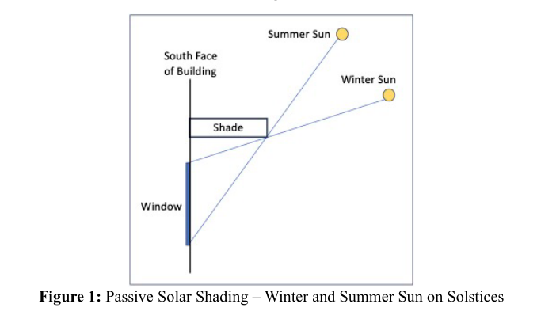
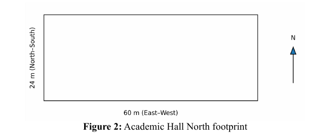

# 2026 ICM 题目 E: 被动式太阳能遮阳

## 背景
被动式太阳能遮阳已成为住房和商业建筑改造或新建项目中的常见补充。它相对便宜，并且能在供暖和制冷方面节省成本。遮阳装置的设计旨在阻挡夏季阳光进入建筑物，同时允许冬季阳光不仅进入建筑物，还能加热可在之后数小时内重新辐射热量的热学材料（thermal mass）。诸如悬挑、植被遮阳、遮阳板系统和高性能玻璃等策略可以在较高温度下减少建筑物内的热量增加。

被动式太阳能遮阳根据**建筑朝向**、建筑物不同面之间的**窗户面积分布**以及**气候**而有所不同。它还需要内部**热学材料**的存在，该热学材料可以被直接的阳光加热。这种热学材料可以是混凝土、石头、水或其他可以储存热量的材料。热学材料不仅**储存热量**，还能**减少全天的温度波动**。这些技术利用太阳的**可预测路径**（通过使用太阳位置计算器确定）、**材料**、**几何形状**和**自然环境条件**来保持舒适度并降低能耗。然而，**典型的计算利用夏至和冬至时太阳正午的太阳角度来计算窗户上方遮阳板的最佳延伸长度**。这是对问题的简化看法，未来的指标必须更好地应对变化。

## 场景
您已被“集体组织制定天体物理保护措施”（COMAP）聘用，为虚构的**Sungrove大学**和虚构的**Borealis大学**实施下一代太阳能遮阳策略的创新。

虚构的**Sungrove大学**位于温暖、低纬度地区，拥有高太阳辐射和日益频繁的热浪，正计划对其主要学术四合院进行重大改造。校园目前遭受过度的制冷成本和教室内的眩光问题。大学领导层已决定在2040年之前实施净零冷却（net-zero cooling）计划。
值得注意的是，Sungrove大学正计划改造其**学术北厅（Academic Hall North）**。这是一栋两层的教室和办公楼。内部布局结合了周边的办公室和教室以及内部走廊。该建筑拥有矩形占地面积（60米 x 24米），其长边呈东西向排列。立面由双层玻璃和砖饰面组成，南向侧的平均窗墙比为45%，其余侧为30%。该建筑在**夏季依赖机械制冷**，在**冬季依赖循环水加热**，现有的被动策略有限。这座虚构建筑的其他特征您可以自行想象。确保您在给COMAP的报告中传达这些特征。

此外，COMAP已被虚构的**Borealis大学**聘用，该大学位于高纬度地区，冬季气温连续数月保持在冰点以下，日照时间有限，且建筑物有沉重的供暖需求。

Sungrove大学和Borealis大学也都计划新建一个学生会大楼，作为大学活动的中心。他们各自强制要求其新学生会大楼严重依赖被动式太阳能遮阳而不是机械制冷系统。这两所大学希望他们的学生会大楼能作为未来发展的原型，这意味着他们的被动式太阳能策略设计必须不仅在今天表现良好，而且在未来预测的气候条件下也能表现良好。

除了背景中概述的标准遮阳方法外，为了协助这些虚构的大学，您应该扩展您的想法以包括：
* 全天的遮阳需求，而不仅仅是太阳正午。
* 不同尺寸和形状的窗户。
* 不完全朝南/朝北（取决于半球）的窗户。
* 与建筑风格相匹配的不同风格和材料的遮阳装置。

与任何新策略或模型一样，您不仅需要描述您的方法，还需要解释您的提议相对于以前标准的优势。COMAP需要知道您的被动式太阳能遮阳策略如何更有效地减少夏季校园建筑的热量增加，同时仍能接纳有益的冬季阳光。

## 要求

您的团队被COMAP要求提供基于模型的可行性分析，确定Sungrove大学如何通过校园建筑改造中的被动式太阳能设计来减少其学年的制冷负荷。

1.  **Sungrove改造设计：** 为Sungrove大学的学术北厅设计一个改造方案，优化整个学年的供暖和制冷。您会使用什么被动式太阳能策略和建筑特征，您将如何评估它们的性能？

2.  **Borealis应用与热学材料：** Borealis大学有一栋与Sungrove大学学术北厅设计相似的建筑。如何扩展您为Sungrove大学所做的工作，以包含有效使用热学材料的关键重要性，从而为Borealis大学提供使用被动式太阳能遮阳的计划？您可能需要考虑建筑几何形状、材料选择、玻璃位置、内部热学材料或其他方面，以最大化冬季热量获取，同时避免温暖月份的过热。

3.  **其他地点的适应性：** Sungrove和Borealis大学的改造设计模型仅对这些虚构地点有用。调整您的模型并讨论其他地点的设计注意事项，包括在可能具有相似纬度的地方的不同供暖和制冷需求。

4.  **新学生会大楼设计：** 为Sungrove大学**或**Borealis大学（二选一）的新学生会大楼设计被动式太阳能遮阳策略，使建筑物保持温和适宜。描述您将用于评估随时间推移的性能的策略、建筑特征和建模方法。
    您可能希望在分析中解决以下一些问题：
    * 预测太阳热量获取
    * 估算供暖和/或制冷负荷的减少
    * 考虑季节性变化
    * 评估采光需求和遮阳有效性之间的权衡

5.  **信件：** 给Sungrove大学**或**Borealis大学（不是两者）写一封一到两页的信，概述他们在改造和新建筑计划中纳入被动式太阳能遮阳应采取的步骤。

## 提交指南
您的PDF解决方案总页数不超过25页，应包含：
* 一页摘要页（Summary Sheet）。
* 目录。
* 您的完整解决方案。
* 一到两页的信件。
* 参考文献列表。
* AI使用报告（如果使用了AI，该报告不计入25页限制）。

**术语表：**

* **太阳正午 (Solar noon)：** 一天中太阳位于给定地点天空中最高点的时刻。
* **冬至 (Winter Solstice)：** 一年中白昼最短的一天，由地球倾斜引起。
* **夏至 (Summer Solstice)：** 一年中白昼最长的一天，由地球倾斜引起。
* **虚构的 (Notional)：** 意味着理论上的或虚构的。本题中的大学不是真实的，只是理论案例研究。
* **净零冷却 (Net-zero cooling)：** 提供冷却而不向大气中增加温室气体。
